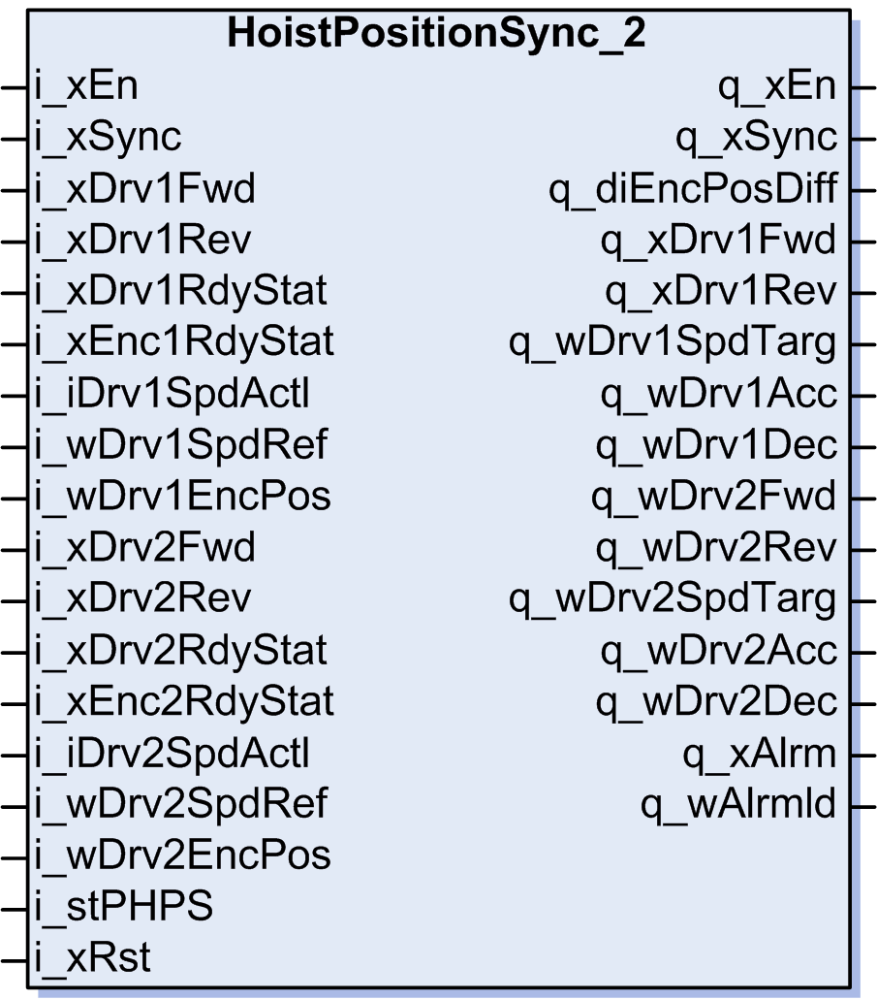

# Function Block Description

Function Block Description

HoistPositionSync\_2 Function Block

Pin Diagram

Function Block Description

The HoistPositionSync\_2 function block has the following features:

oSynchronizes motion of 2 axes to keep their relative position.

oSupports synchronization of axes with different motors, gears, and encoders.

oSupports both absolute and incremental encoders.

oSupports permanent synchronization mode (Synchronization continues after power cycle).

EIO0000003890.01

© 2020 Schneider Electric. All rights reserved.