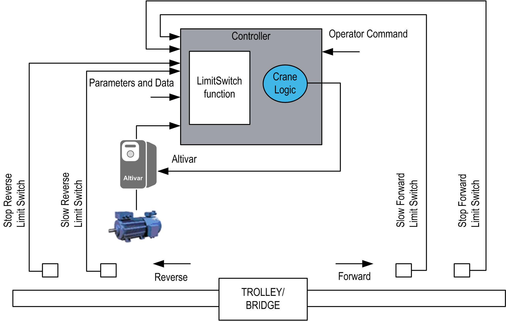

# Functional Overview

Functional Overview

Functional Overview

Functional Description

The LimitSwitch function block is applicable to the following types of cranes:

oIndustrial Cranes (trolley, bridge and hoisting movement)

oConstruction Cranes (trolley, slewing and hoisting movement)

The LimitSwitch function block reads limit switch inputs from the field. It checks the limit switch status and generates the control outputs which are used to control the movements of the crane.

The function block is designed for use with cross and screw limit switches using Normally Closed (NC) contacts. The contacts indicate the specific status, for example, the stop position.

Why Use the LimitSwitch Function Block?

The LimitSwitch function block monitors and controls the movement of the trolley/bridge to help prevent it from crashing into the mechanical barrier at each end of the rails.

This block can also be used for hoisting and slewing movement. For example, when the block is used in hoisting movement, it stops the hook from crashing into the trolley or from over-winding the drum.

This function block is intended to have significant influence on the physical movement of the crane and its load. The application of this function block requires accurate and correct input parameters in order to make its movement calculations valid and to avoid hazardous situations. If invalid or otherwise incorrect input information is provided by the application, the results may be undesirable.

|  |
| --- |
| Warning_Color.gifWARNING |
| UNINTENDED EQUIPMENT OPERATION |
| Validate all function block input values before and while the function block is enabled. |
| Failure to follow these instructions can result in death, serious injury, or equipment damage. |

Solution with the LimitSwitch Function Block

The function block has one slow switch and one stop switch on each end. If only the slow-switch is used, then the stop can be executed using the integrated Stop on Distance function which automatically calculates the remaining distance and brings the system to a stop.

|  |
| --- |
| Warning_Color.gifWARNING |
| UNINTENDED EQUIPMENT OPERATION |
| oDo not use impulse or normally open contact switches in association with the function blocks.  oOnly use Normally Closed contact switches with the function blocks. |
| Failure to follow these instructions can result in death, serious injury, or equipment damage. |

Functional View

EIO0000003890.01

© 2020 Schneider Electric. All rights reserved.