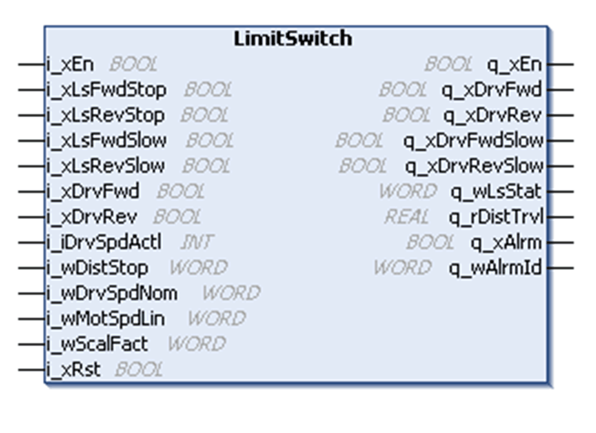
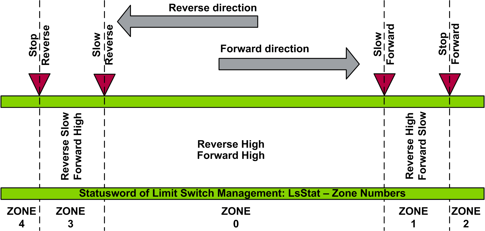

# LimitSwitch Function Block

LimitSwitch Function Block

Pin Diagram

Function Block Description

The LimitSwitch function block handles up to 4 movement positions for trolley, bridge, hoisting or slewing. This includes the following:

oForward stop position

oForward slow position

oReverse stop position

oReverse slow position

The following figure shows the zones of the q\_wLsStat (status word output of the function block).

EIO0000003890.01

© 2020 Schneider Electric. All rights reserved.