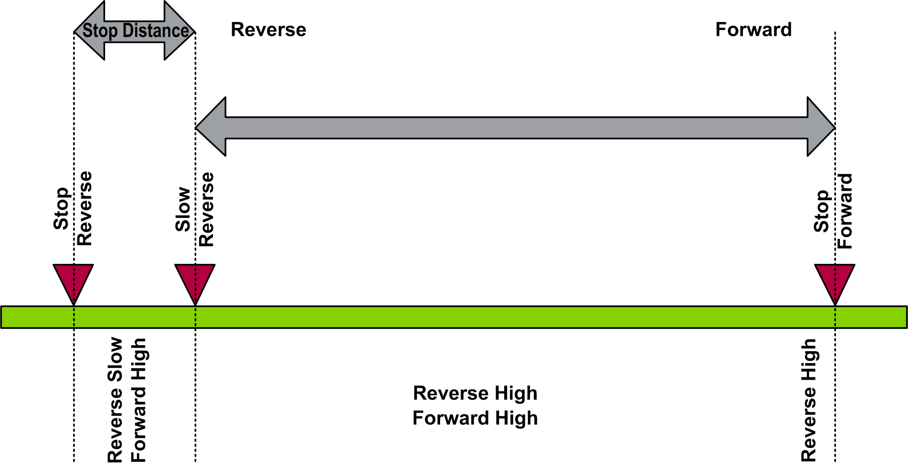

# Configuration of the Movement Positions

Configuration of the Movement Positions

Fwd/Rev Stop and Fwd/Rev Slow: Configuration of 4 Positions

Fwd/Rev Slow: Configuration with Stop on Distance

NOTE: If a Stop on Distance is executed while in the non-working zone, movement towards the slow switch is possible, but movement in the opposite direction is blocked until the slow limit switch is passed.

Fwd/Rev Stop: Configuration of 2 Positions

Fwd/Rev Stop and Rev Slow: Configuration of 3 Positions

Fwd/Rev Stop and Fwd Slow: Configuration of 3 Positions

Remark

If any of the limit switch positions are not used, the related input on the function block must be set to TRUE, as the LimitSwitch function block is designed for N.C. configuration.

Normal Cycle

When the system is moving in the forward direction, and Forward Slow position (i\_xLsFwdSlow)is initiated, the function block enables the Forward Slow signal (q\_xDrvFwdSlow). When the Forward Stop position (i\_xLsFwdStop)is initiated, the function block turns off the Forward Allow signal(q\_xDrvFwd).

When the system is moving in the reverse direction and Reverse Slow position (i\_xLsRevSlow)is initiated, the function block enables the Reverse Slow signal (q\_xDrvRevSlow). When the Reverse Stop position (i\_xLsRevStop)is initiated, the function block turns off the Reverse Run signal (q\_xDrvRev).

Stop on Distance

The function block has the functionality to stop the trolley/bridge on distance after passing the Slow Forward or Slow Reverse position. To enable this functionality, enter any value greater than zero at i\_wDistStop. If the input is equal to zero, the Stop on Distance function is disabled.

The function block converts the actual RPM from the drive to the equivalent actual linear speed in m/s. From this conversion, the function block calculates the traveled distance. When the traveled distance is greater than the configured stop distance, the Forward Run signal(q\_xDrvFwd)or the Reverse Run signal(q\_xDrvRev)is turned off (depending on which way the crane is moving).

Example:

oStop distance: 3 m

oNominal speed of the drive: 1500 RPM

oNominal linear speed: 1 m/s

oIf the actual speed of the drive = 600 RPM, the actual linear speed (m/s) =

1 m/s \* 600 RPM /1500 RPM = 0.4 m/s

oDistance traveled in meters during one sample time = ((0.4 m/s \* Sample Rate in ms)/1000)

oWhen the distance traveled is greater than the stop distance, the drive stops and further movement in the same direction is not allowed.

The following figure represents the speed time curve of LimitSwitch function block.

EIO0000003890.01

© 2020 Schneider Electric. All rights reserved.