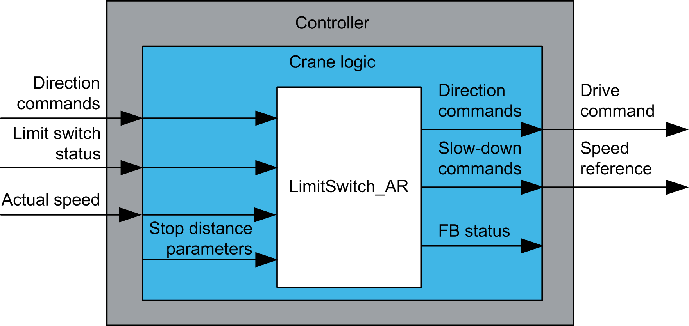

# Functional Overview

Functional Overview

Functional Overview

Functional Description

The LimitSwitch\_AR function block interprets the information received from limit switch sensors in the system, so that the information can be easily exploited by the user application in a controller.

Why Use the LimitSwitch\_AR Function Block?

This function block helps to prevent moving parts of a crane from reaching areas out of their operational range. It can be used on the trolley, bridge, hoist or slewing movement of any crane equipped with limit switch sensors.

The adaptive ramp feature allows higher performance of a crane while moving in the slow-down area by calculating the maximum allowed velocity at the actual position rather than simply slowing down to a pre-defined slow speed after a slow-down limit switch is activated.

This function block is intended to have significant influence on the physical movement of the crane and its load. The application of this function block requires accurate and correct input parameters in order to make its movement calculations valid and to avoid hazardous situations. If invalid or otherwise incorrect input information is provided by the application, the results may be undesirable.

|  |
| --- |
| Warning_Color.gifWARNING |
| UNINTENDED EQUIPMENT OPERATION |
| Validate all function block input values before and while the function block is enabled. |
| Failure to follow these instructions can result in death, serious injury, or equipment damage. |

Solution With the LimitSwitch\_AR Function Block

The function block has 2 inputs for stop limit switches and 2 inputs for slow-down limit switches (forward and reverse).

All signals must come from Normally Closed switches. When an axis enters a slow or stop area, the limit switch must give a constant signal.

NOTE: Impulse limit switches are not supported.

|  |
| --- |
| Warning_Color.gifWARNING |
| UNINTENDED EQUIPMENT OPERATION |
| oDo not use impulse or normally open contact switches in association with the function blocks.  oOnly use Normally Closed contact switches with the function blocks. |
| Failure to follow these instructions can result in death, serious injury, or equipment damage. |

An arbitrary configuration of inputs is supported. Inputs that are not used must be set to TRUE.

The adaptive ramp function calculates the maximum speed the axis can move in a slow-down area depending on the calculated position (without using a position sensor). This solves the problem of a standard limit switch which limits the speed to a pre-defined slow speed directly after entering the slow-down area and significantly increases performance of cranes which have to enter the slow-down area regularly.

Functional View

EIO0000003890.01

© 2020 Schneider Electric. All rights reserved.