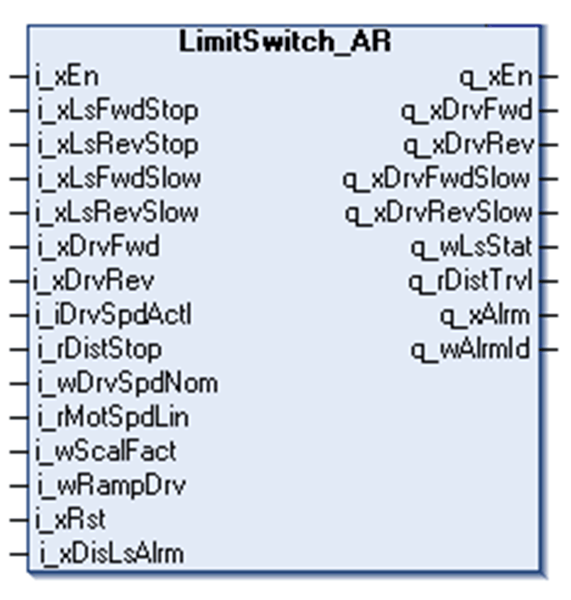
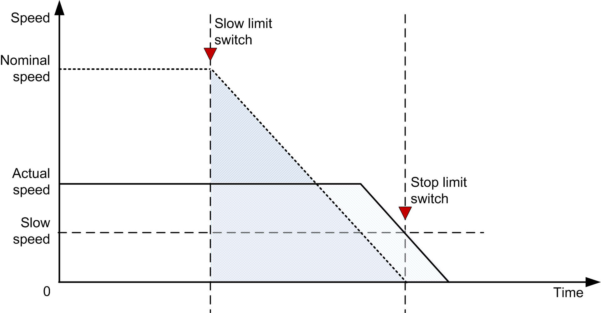

# Function Block Description

Function Block Description

LimitSwitch\_AR Function Block

Pin Diagram

Function Block Description

This function block handles up to 4 movement positions for trolley, bridge, hoisting or slewing:

oForward stop position

oForward slow position

oReverse stop position

oReverse slow position

Remark

If any of the limit switch positions are not used, the related input on the function block must be set to TRUE, as the limit switch management function is designed for NC configuration.

Standard Limit Switch Behavior

The [standard limit switch function block](../Limit_Switch/Limit_Switch-1.htm#XREF_D_SE_0003365_1) allows the axis to move at any given speed until either of the slow limit switches is reached. To enable this function, enter a value of zero into the i\_rDistStop input. Any other value enables the adaptive ramp function.

Example:

When the system moves in the forward direction and the Forward slow position i\_xLsFwdSlow is reached, the function block enables the Forward slow signal q\_xDrvFwdSlow. When the Forward stop position i\_xLsFwdStop is reached, the function block turns OFF the Forward command output signal q\_xDrvFwd. .

When the system moves in the reverse direction and the Reverse slow position i\_xLsRevSlow is reached, the function block enables the Reverse slow signal q\_xDrvRevSlow. When the Reverse stop position i\_xLsRevStop is reached, the function block turns OFF the reverse command output signal q\_xLsRevStop.

Adaptive Ramp Behavior

The adaptive ramp function allows the axis to move at any given speed as long as it is possible. To enable this function, enter the desired stop distance in meters into the i\_rDistStop input. If a value of zero is entered, the adaptive ramp function will be disabled.

Example:

When the system is moving in the forward direction and the Forward slow position i\_xLsFwdSlow is initiated, the function block enables the internal calculation of the remaining distance according to the actual speed.The function block calculates the traveled distance by integrating actual speed of the drive over time. The adaptive ramp function allows the FB to calculate the highest available speed while the axis is in a slow-down area.

Once the last possible point in time is reached to slow down the movement according to the chosen ramp, the Forward slow signal q\_xDrvFwdSlow is set TRUE and the movement is stopped. When the Forward stop position i\_xLsFwdStop is initiated, the function block turns OFF the Forward allow signal q\_xDrvFwd. The function works the same for the reverse direction.

The following figures describe the benefit of using an adaptive ramp function.

NOTE: The following chart shows the actual speed of the drive.

The first chart shows the behavior when entering a properly configured slow-down area at nominal speed:

The second chart describes entering the slow-down area at a speed that is approximately half of the nominal speed with an adaptive ramp function:

The third chart shows the behavior without the adaptive ramp function. The shaded area corresponds to the distance traveled in slow-down area at a given speed:

The function block can work in 2 modes depending on the value of the i\_rDistStop input:

| Mode | Meaning |
| --- | --- |
| Adaptive ramp | The FB removes the direction command after the preset stop distance has been traveled. |
| Slow-down only | After the Slow switch became FALSE, the q\_xDrvFwdSlow or q\_xDrvRevSlow is set to TRUE, until the Hardware Stop Limit switch is reached. |

EIO0000003890.01

© 2020 Schneider Electric. All rights reserved.