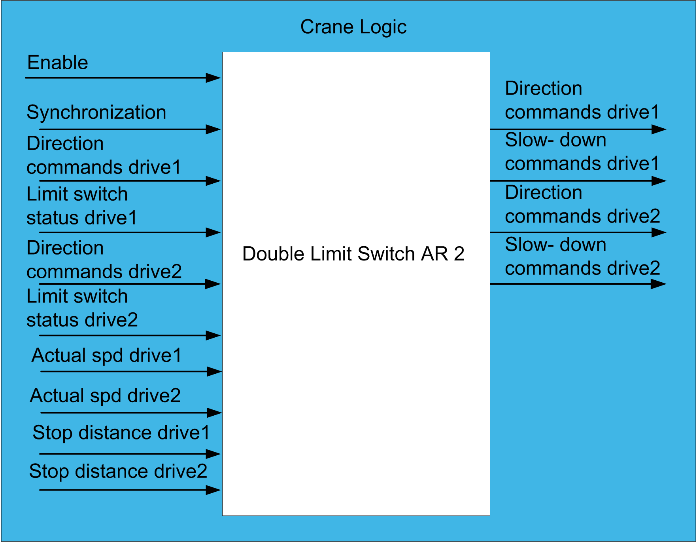

# Functional Overview

Functional Overview

Functional Overview

Functional Description

The function reads limit switch inputs from the field. It checks the status on 2 limit switches and generates the control outputs which are used to control the crane’s movements. The function block is designed for use with cross and screw limit switches using Normally Closed (NC) contacts and a photoelectric sensor. The contacts retain the current status, for example, the stop position.

|  |
| --- |
| Warning_Color.gifWARNING |
| UNINTENDED EQUIPMENT OPERATION |
| oDo not use impulse or normally open contact switches in association with the function blocks.  oOnly use Normally Closed contact switches with the function blocks. |
| Failure to follow these instructions can result in death, serious injury, or equipment damage. |

NOTE: The function block is constructed by combining 2 LimitSwitch\_AR function blocks into one. The behavior of the FB in the Asynchronous mode is similar to 2 separate LimitSwitch\_AR function blocks.

Why Use the DoubleLimitSwitch\_AR\_2 Function Block?

The function is required to monitor and control the movement of 2 bridges/trolleys to help prevent it from crashing into the mechanical barrier at either end of the rails and to avoid the collision between adjacent bridges/trolleys running on the same axis.

This block can also be used for hoisting and slewing movements. When the block is used in hoisting movement, it stops the hook from crashing into the trolley or from over-winding the drum. The FB handles all the necessary interlocks between synchronous and asynchronous behavior of limit switches.

NOTE: The DoubleLimitSwitch\_AR\_2 function block is compatible with the GrabControl function block. This means, that the commands for Hold Drive and Close Drive are computed from the DoubleLimitSwitch\_AR\_2 while the FB is in synchronized mode.

This function block is intended to have significant influence on the physical movement of the crane and its load. The application of this function block requires accurate and correct input parameters in order to make its movement calculations valid and to avoid hazardous situations. If invalid or otherwise incorrect input information is provided by the application, the results may be undesirable.

|  |
| --- |
| Warning_Color.gifWARNING |
| UNINTENDED EQUIPMENT OPERATION |
| Validate all function block input values before and while the function block is enabled. |
| Failure to follow these instructions can result in death, serious injury, or equipment damage. |

Solution with the DoubleLimitSwitch\_AR\_2 Function Block

The DoubleLimitSwitch\_AR\_2 manages motion limits of two physically related axes. It can be used for limit switch management of two hoists, two crane trolleys or two crane bridges. It is compatible with a wide variety of limit switch sensors including cross, screw, optical, ultrasound, and inductive devices. The state of limit switch signals must correspond to the position of the axis. Limit switch devices which output an impulse at the change between working and slow-down as well as slow-down and stop areas are not supported.

The function block can operate in synchronized or independent mode:

oIn synchronized mode, both axes are stopped or slowed-down if one of them reaches the stop or slow-down zone.

oIn asynchronous mode, both axes are controlled independently based on the states of their respective limit switch signals.

The function block supports the stop on distance mode. If this feature is used, the function block integrates the actual motor speed while the axis is in the slow-down zone and stops the movement as soon as it reaches the virtual stop limit switch position.

Crane systems with two trolleys on one crane bridge or two bridges on one crane runway may be implemented using contactless limit switch sensors for detecting slow and stop relative positions of two trolleys or bridges.

Functional View

EIO0000003890.01

© 2020 Schneider Electric. All rights reserved.