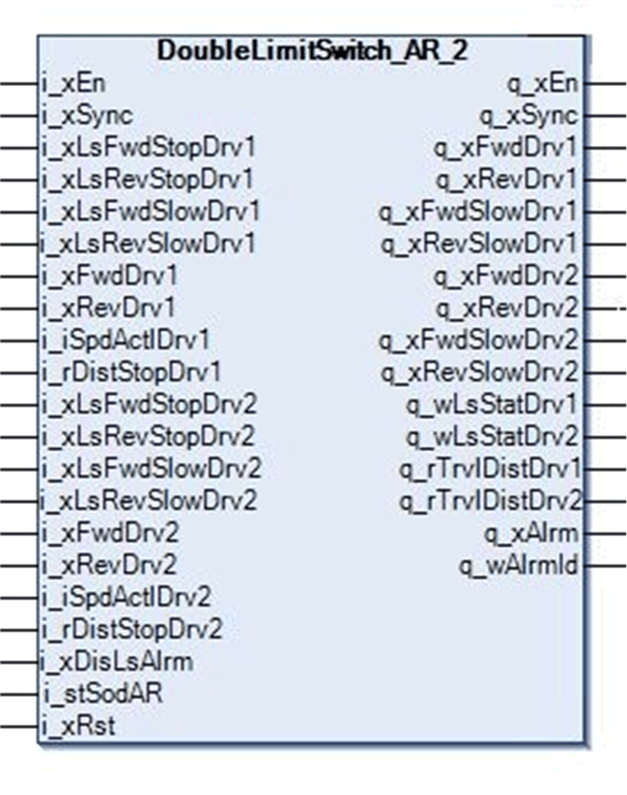
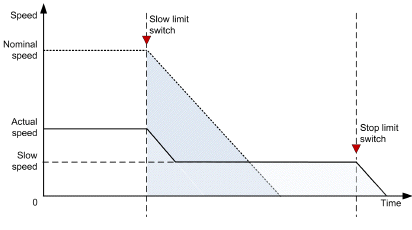

# Function Block Description

Function Block Description

DoubleLimitSwitch\_AR\_2 Function Block

Pin Diagram

Function Block Description

This function block handles up to 4 movement positions for trolley, bridge, hoisting or slewing.

This includes the following:

oForward stop position

oForward slow position

oReverse stop position

oReverse slow position

Remark

If any of the limit switch stop positions is not used, or the slow position is only used in one direction, set the related input on the function block to TRUE, as the limit switch management function is designed for N.C. configuration. If using the adaptive ramp function of the block, the corresponding slow limit switch for the desired direction must be present.

By using the DoubleLimitSwitch\_AR\_2 FB for managing the movement of 2 bridges or 2 trolleys on industrial crane, extra protection is required to be provided when they approach each other.

|  |
| --- |
| Warning_Color.gifWARNING |
| COLLISION OF TWO BRIDGES/TROLLEYS |
| Use proximity sensors to avoid collisions between bridges/trolleys. |
| Failure to follow these instructions can result in death, serious injury, or equipment damage. |

Adaptive Ramp Behavior

In the adaptive ramp mode, the FB calculates positions at which the axes have to slow down based on their estimated positions. To enable this function, the parameters i\_rDistStopDrv1 and i\_rDistStopDrv2 must be not equal zero.

NOTE: In synchronization mode to prevent collision between the both axis the value of the parameters i\_rDistStopDrv1 and i\_rDistStopDrv2 is compared and the lowest value is written to the both parameters.

No Synchronization

| If... | Then ... |
| --- | --- |
| the system moves in the forward direction and the Forward slow position i\_xLsFwdSlowDrv1 is reached and the parameter i\_rDistStopDrv1 is equal zero, | the function block enables the Forward slow signal q\_FwdSlowDrv1. |
| the Forward stop position i\_xLsFwdStopDrv1 is reached, | the function block turns OFF the Forward command output signal q\_xFwdDrv1. |
| the system moves in the reverse direction and the Reverse slow position i\_xLsRevSlowDrv1 is reached and the parameter i\_rDistStopDrv1 is equal zero, | the function block enables the Reverse slow signal q\_xRevSlowDrv1. |
| the Reverse stop position i\_xLsRevStopDrv1 is reached, | the function block turns OFF the Reverse command output signal q\_xRevdDrv1. |

The function is the same for the axis of drive 2.

Synchronization

| If... | Then ... |
| --- | --- |
| i\_xSync is TRUE, | the signal information of both connected limit switches is analyzed simultaneously and the result is written to the Drive 1 and the Drive 2 outputs. |
| the system moves in the forward direction and the Forward slow position (i\_xLsFwdSlowDrv1 or i\_xLsFwdSlowDrv2) is reached and both parameters (i\_rDistStopDrv1, i\_rDistStopDrv2) are zero, | the function block enables the Forward slow signal of both drives q\_FwdSlowDrv1 and q\_FwdSlowDrv2. |
| the Forward stop position (i\_xLsFwdStopDrv1 or i\_xLsFwdStopDrv2) is reached, | the function block turns OFF the Forward command output signals q\_xFwdDrv1 and q\_xFwdDrv2. |
| the system moves in the reverse direction and the reverse slow position (i\_xLsRevSlowDrv1 or i\_xLsRevSlowDrv2) is reached and the both parameters (i\_rDistStopDrv1, i\_rDistStopDrv2) are zero, | the function block enables the Reverse slow signal of both drives q\_xRevSlowDrv1 and q\_xRevSlowDrv2. |
| the Reverse stop position (i\_xLsRevStopDrv1 or i\_xLRevdStopDrv2) is reached, | the function block turns OFF the Reverse command output signals q\_xRevDrv1 and q\_xRevDrv2. |
| the system is moving in the forward direction and the Forward slow position i\_xLsFwdSlowDrv1 or i\_xLsFwdSlowDrv2 is initiated while the parameters i\_rDistStopDrv1 and i\_rDistStopDrv2 are not equal zero, | the function block enables the internal calculation of the remaining distance according to the actual speed. |
| the calculated distance is greater than lower of the two stop distance values (i\_rDistStopDrv1 or i\_rDistStopDrv2), | the function block turn OFF the Forward command output signals q\_xFwdDrv1 and q\_xFwdDrv2. |
| the system is moving in the reverse direction and the reverse slow position (i\_xLsRevSlowDrv1 or i\_xLsRevSlowDrv2) is initiated while the parameters i\_rDistStopDrv1 and i\_rDistStopDrv2 are not equal zero, | the function block enables the internal calculation of the remaining distance according to the actual speed. |
| the calculated distance is greater than lower of the two stop distance values (i\_rDistStopDrv1 or i\_rDistStopDrv2), | the function block turn OFF the Forward command output signals q\_xFwdDrv1 and q\_xFwdDrv2. |

The function block calculates the traveled distance by integrating actual speed of the drive over time.

The adaptive ramp function allows the FB to calculate the highest available speed while the axis is in a slow-down area.

Example

oStop distance: 3 m

oNominal speed of the drive: 1500 RPM

oNominal linear speed: 1 m/s

oIf the actual speed of the drive = 600 RPM, the actual linear speed (m/s) = 1/ms \* 600 RPM / 1500 RPM = 0.4 m/s

oDistance traveled in meters = ((0.4 m/s \* internal calculated cycle time) / 1000)

oWhen the distance traveled is greater than the stop distance, the drive stops and further movement in the same direction is not allowed.

NOTE: The following chart shows the actual speed of the drive.

The following figure represents the speed time curve of DoubleLimitSwitch\_AR\_2 function block:

The following figures describe the benefit of using an adaptive ramp function.

The first chart shows the behavior when entering a property configured slow-down area at nominal speed:

The second chart describes entering a slow-down area at a speed that is approximately half of the nominal speed with an adaptive ramp function:

The third chart shows the behavior without the adaptive ramp function. The shaded area corresponds to the distance traveled in a slow-down area at a given speed.

By using the DoubleLimitSwitch\_AR\_2 for 2 cranes (bridges or trolleys) moving on the same rail, the input i\_xDisLsAlrm has to set to TRUE to disable alarms based on combination of limit switch states.

|  |
| --- |
| Warning_Color.gifWARNING |
| COLLISION OF TWO BRIDGES/TROLLEYS |
| Use proximity sensors to avoid collisions between bridges/trolleys. |
| Failure to follow these instructions can result in death, serious injury, or equipment damage. |

When 2 cranes approach each other, the sensor head receives signal a reflected from the reflector. With this, presence of another crane is sensed and movement of approaching crane is stopped in that particular direction. The crane can move in any other direction (away from another crane) any time. Likewise, another unit is fixed on another crane and its reflector is fixed on the first crane. Therefore, each time the cranes approach each other within a specified distance, movement is stopped and collision of the cranes is avoided.

EIO0000003890.01

© 2020 Schneider Electric. All rights reserved.