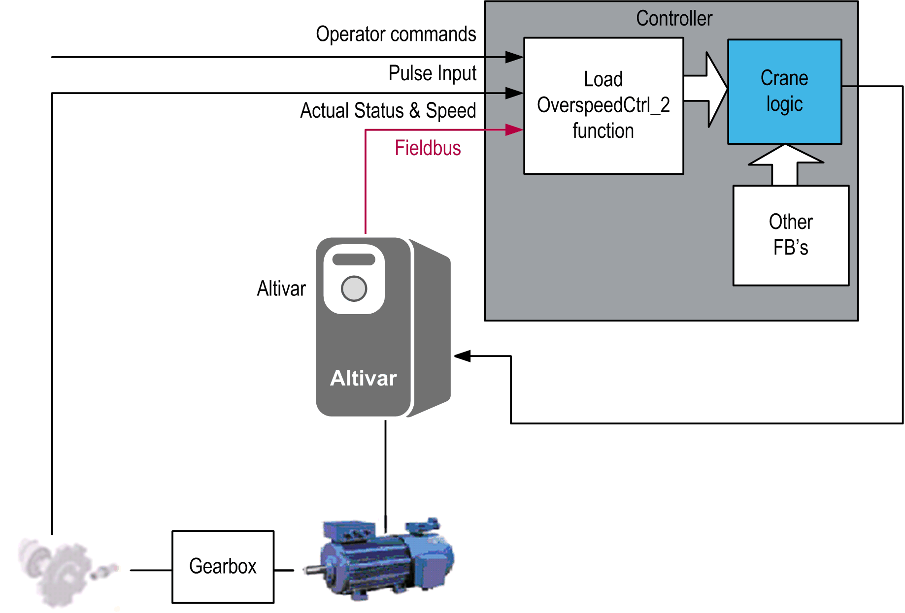

# Functional Overview

Functional Overview

Functional Overview

Functional Description

The Load Overspeed Control 2 function block (LoadOverspeedCtrl\_2) is used to detect load overspeed and brake wear. If the hoist moves at a speed faster than configured overspeed threshold the function block raises an overspeed alarm. The function block also detects movement of the hoist when the drive is not in RUN mode. The sensor feedback function tests the connection between the sensor and the controller input and generates an alarm if the sensor does not deliver any signal although the motor is running.

The function is used to detect:

oLoad overspeed

oBrake wear

oSensor feedback loss

The LoadOverspeedCtrl\_2 function block is applicable to:

oConstruction cranes

oIndustrial cranes

Why Use the LoadOverspeedCtrl\_2 Function Block?

Load overspeed and brake wear must be considered for the correct operation of the hoisting mechanism. Any situation caused by a load moving too fast or that cannot be stopped must be detected.

This FB is an evolution of LoadOverspeedCtrl FB. It has a simplified interface and higher precision of measurement. There are several modifications to minimize the reaction time after the detecting of overload, brake wear and sensor feedback alarms and to improve the compatibility with other hoisting function blocks.

Solution with the LoadOverspeedCtrl\_2 Function Block

LoadOverspeedCtrl\_2 FB monitors the speed using a proximity sensor. It senses teeth of a cogwheel connected to the drum of the hoisting axis. The FB uses the pulses to calculate speed of rotation of the motor shaft in RPM (revolutions per minute). This calculated speed is compared with the predefined threshold speed and an alarm is signaled if the calculated speed exceeds the overspeed threshold.

An encoder can be used instead of a proximity sensor as long as it is connected to the drum of the hoisting axis and not directly to the motor shaft. It is important to measure actual speed of the drum rather than speed of the motor shaft in case the mechanical connection between the motor and the drum was interrupted.

Functional View

EIO0000003890.01

© 2020 Schneider Electric. All rights reserved.