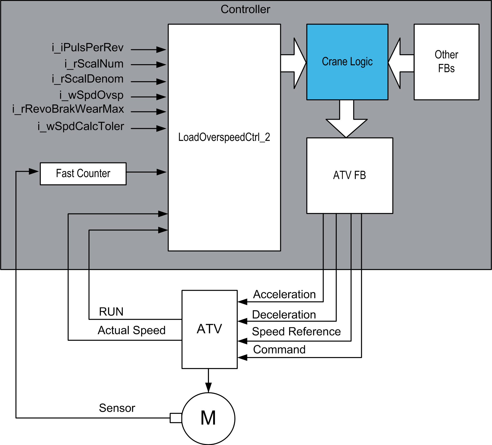

# Software Architecture

Software Architecture

Software Architecture Overview

The maximum allowed speed for detecting overspeed, the maximum allowed rotation of motor for detecting brake wear, tolerance of motor speed accuracy and gear box ratio factors have to be set during commissioning. The pulses from the proximity sensor are passed to one of the fast counter inputs of the controller. If a load overspeed, brake wear or sensor feedback incident occurs, an alarm is signaled.

The function block contains an alarm which is signaled if the inputs are not configured correctly.

EIO0000003890.01

© 2020 Schneider Electric. All rights reserved.