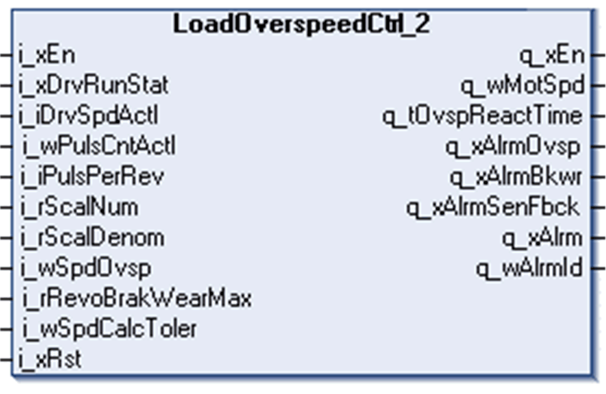

# LoadOverspeedCtrl_2 Function Block

LoadOverspeedCtrl\_2 Function Block

Pin Diagram

Load Overspeed Detection

This function collects pulses from the proximity sensor or encoder and converts them into motor speed in RPM according to the predefined speed tolerance, gear box ratio and cogwheel parameters. The proximity sensor can be mounted directly behind the gear box on the cogwheel or on an additional wheel which is connected to the drum shaft.

If the drive is in RUN state and the calculated speed exceeds the user-defined threshold value i\_wSpdOvsp, the function block raises a load overspeed alarm.

Brake Wear Detection

This function detects a sinking of the load when the drive is not in RUN state. The detected alarm is signaled if the calculated revolutions are higher than the user-defined threshold value i\_rRevoBrakWearMax.

Sensor Feedback Alarm Detection

If the actual speed of the motor is higher than tolerance i\_wSpdCalcToler of the predefined Load overspeed value i\_wSpdOvsp and the sensor does not detect incoming pulses, a sensor feedback alarm is signaled.

NOTE:

oThe alarms are reset with a power cycle to the controller or on a rising edge of the reset input i\_xRst.

oThe alarm status outputs have to be used with the crane control program. This function block does not have direct control of the drive.

EIO0000003890.01

© 2020 Schneider Electric. All rights reserved.