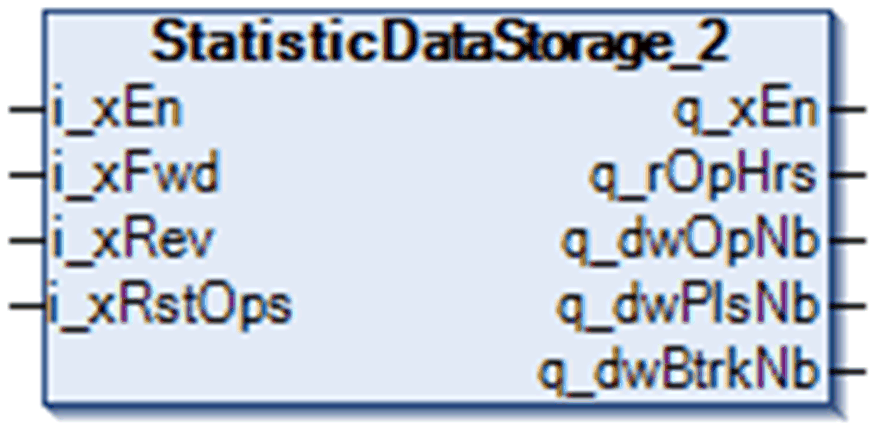

# StatisticDataStorage_2 Function Block

StatisticDataStorage\_2 Function Block

Pin Diagram

Function Block Description

The StatisticDataStorage\_2 function block keeps track of all movements as well as all backtracking and pulsating operations for arbitrary axis.

EIO0000003890.01

© 2020 Schneider Electric. All rights reserved.