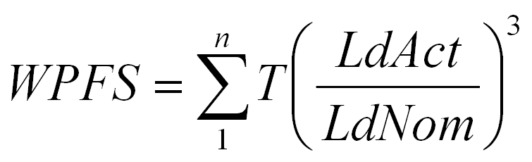

# MaintenanceDataStorage_2 Function Block

MaintenanceDataStorage\_2 Function Block

Pin Diagram

Function Block Description

The MaintenanceDataStorage\_2 function block is used to supervise important maintenance functions. It is used to monitor and provide maintenance information for the Hoist axis:

|  |  |
| --- | --- |
| PFS | Safety work period hoist main gearbox |
| FPFS (Factory PFS) | This is the operation time for the hoist main gearbox with nominal load. This information is provided by the manufacturer. |
| WPFS (Wasted PFS) | This is the proportional number of hours for which the hoist has operated with real load. |
| RPFS (Remain PFS) | The difference between FPFS and WPFS is the RPFS. RPFS is calculated using the formula: RPFS = FPFS - WPFS. |

Formula to Calculate WPFS with a Load Cell

In this case, the following relationship is used to calculate WPFS:

Where:

T= Actual cycle time. This time is calculated internally.

LdAct = Actual load of the hoist.

LdNom = Nominal load of the hoist.

Formula to Calculate WPFS without a Load Cell

In this case, the following relationship is used to calculate WPFS:

Where:

T= Actual cycle time. This time is calculated internally.

TrqAct = Actual motor torque.

TrqNom = Nominal motor torque.

EIO0000003890.01

© 2020 Schneider Electric. All rights reserved.