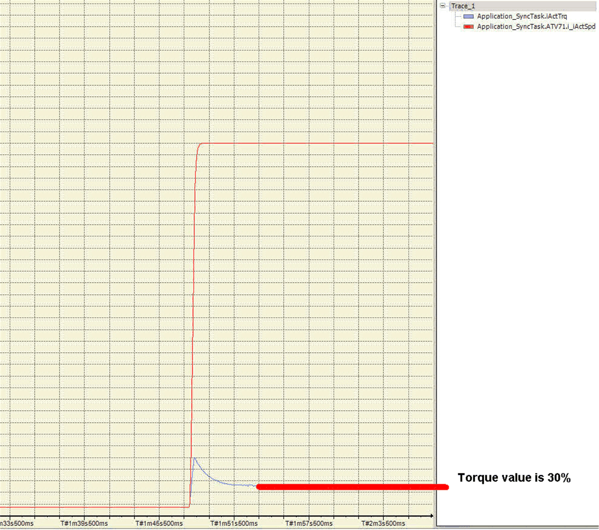

# Commissioning Procedure

Commissioning Procedure

Commissioning Procedure of the MaintenanceDataStorage\_2 Function Block:

The following steps explain the procedure on how to configure the Maintenance­DataStorage\_2 function block using the torque of the drive:

1.Insert a trace object into your EcoStruxure Machine Expert project and map the actual speed and the filtered torque (OTR = actual measured motor torque) to it.

2.Put the nominal load of the crane onto the hock (100% load).

3.Download the trace and start it.

4.Lift the load with nominal speed.

5.Look at the trace and stop it once the torque curve is constant.

6.Determine the average torque during the phase of running at nominal frequency.

Example:

7.Enter the value (here in the example: 30.0%) at the input i\_stMDS.rTrqLoadNom.

8.Connect all other pins and make sure i\_stMDS.xLcEn is FALSE.

EIO0000003890.01

© 2020 Schneider Electric. All rights reserved.