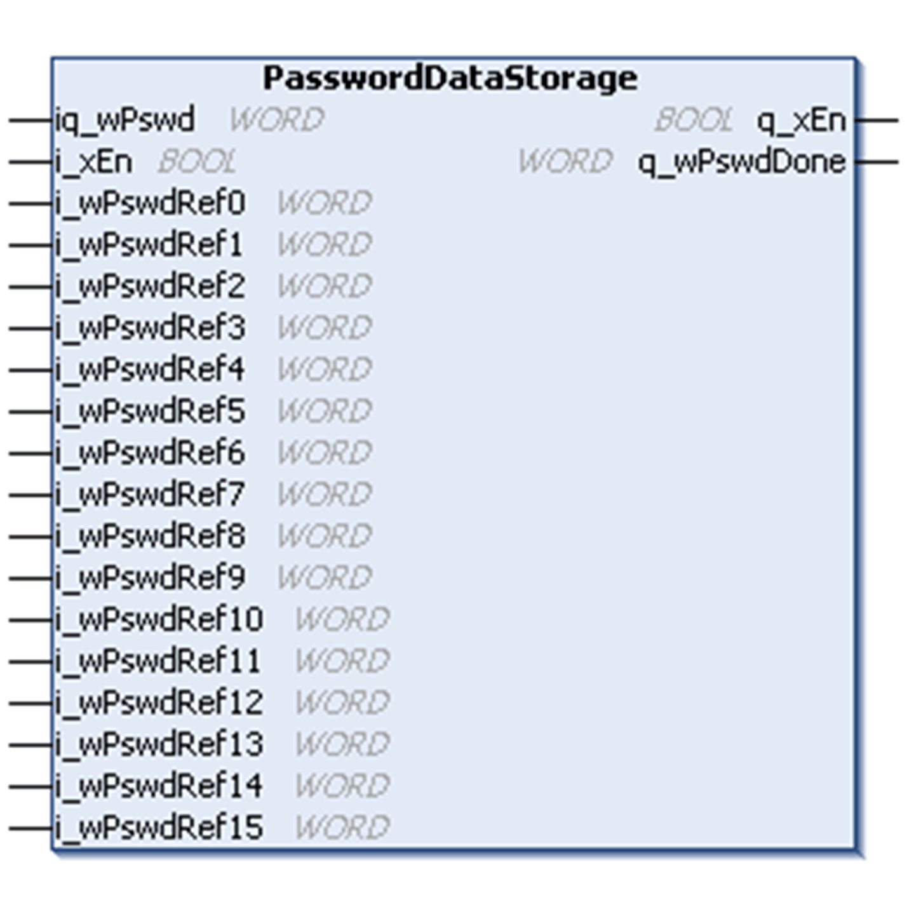
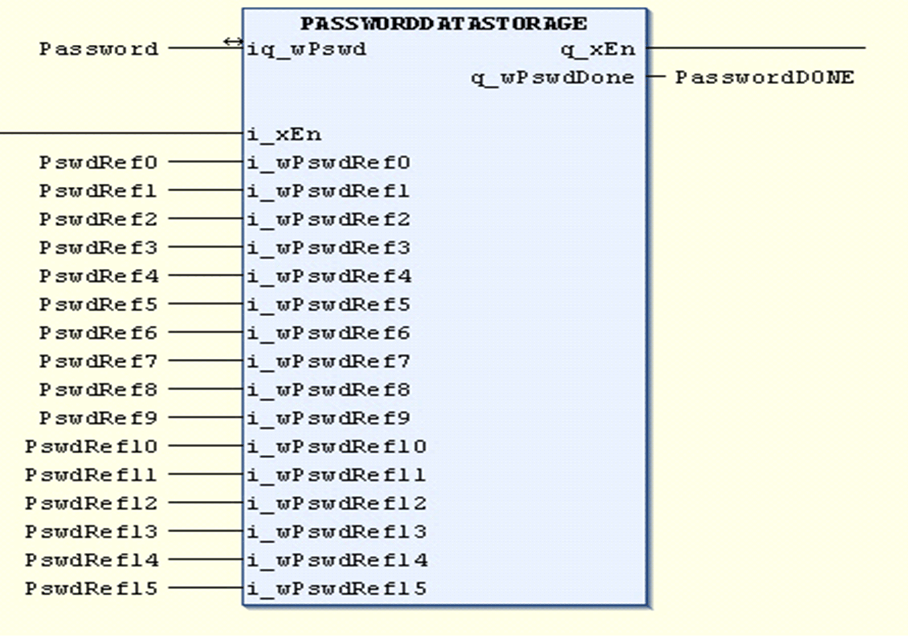

# PasswordDataStorage Function Block

PasswordDataStorage Function Block

Pin Diagram

Function Block Description

The PasswordDataStorage function block is used to reset the data logged in all Monitoring data storage function blocks (StatisticDataStorage\_2, AlarmDataStorage\_2 and MaintenanceDataStorage\_2). An instance of the PasswordDataStorage function block should be connected to the reset pins of all blocks.

For a certain correct password on the password input, the corresponding bit is set to TRUE in the output word.

Passwords have to be assigned to reset the StatisticDataStorage\_2 (to reset hoist data, slew data, trolley data, and traveling data), the AlarmDataStorage\_2 and Maintenance­DataStorage\_2 function block.

Procedure Example

You have to create an instance of the PasswordDataStorage function block as shown in the figure below:

The output variable must be connected bitwise to the reset input (i\_xRst) of the function blocks that should be reset by the PasswordDataStorage function block.

After one cycle, the function block sets the incoming password back to zero.

EIO0000003890.01

© 2020 Schneider Electric. All rights reserved.