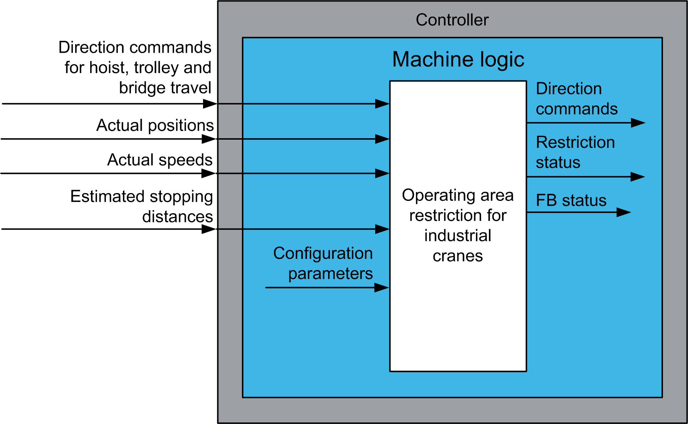

# Functional Overview

Functional Overview

Functional Overview

Why Use the OperatingAreaRestrictionIC Function Block?

The operating area restriction function block helps to prevent a physical contact between the suspended load and obstacles located within the operating area of the crane. The restricted areas are defined in Cartesian coordinates. The function block supports definition of polygonal restricted areas. The areas can be taught in the teach mode. In teach mode the function block uses the present position of crane trolley to define the polygonal restricted areas. Refer to [Teaching the Limits of Restricted Areas](Operating_Area_Restriction_for_Industrial_Cranes-4.htm#XREF_D_SE_0091476_23).

Solution with the AdvancedPositionSync Function Block

The OperatingAreaRestrictionIC function block allows restriction of defined areas within the operating perimeter of an industrial crane.

Functional View

EIO0000003890.01

© 2020 Schneider Electric. All rights reserved.