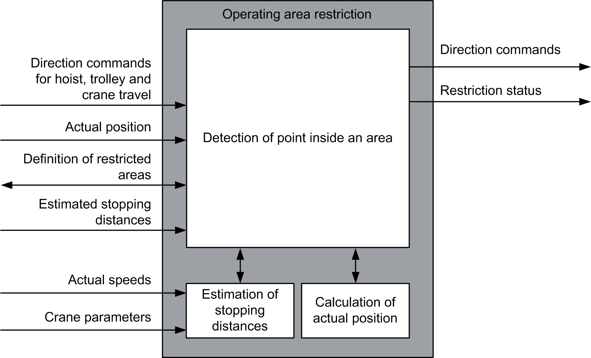

# Architecture

Architecture

Architecture

System Requirements

For details concerning the system requirements, refer to the chapter [System Requirements](../System_Requirements/System_Requirements-1.htm#XREF_D_SE_0003458_1).

Environment

The crane must be equipped with an absolute position measurement on all of the hoist, bridge travel, and trolley axes. The function block can be used together with [AntiSwayOpenLoop\_2](../Anti-Sway_Function/Anti-Sway_Function-20.htm#XREF_D_SE_0020323_1) function block.

Data Flow Overview

EIO0000003890.01

© 2020 Schneider Electric. All rights reserved.