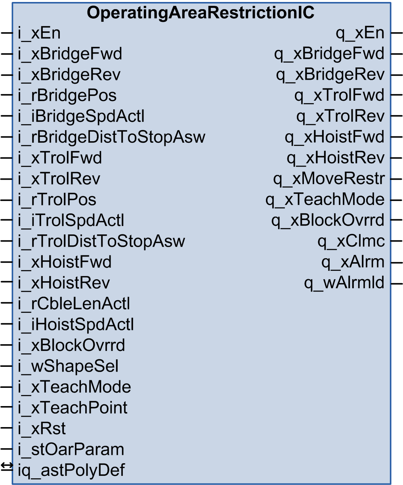
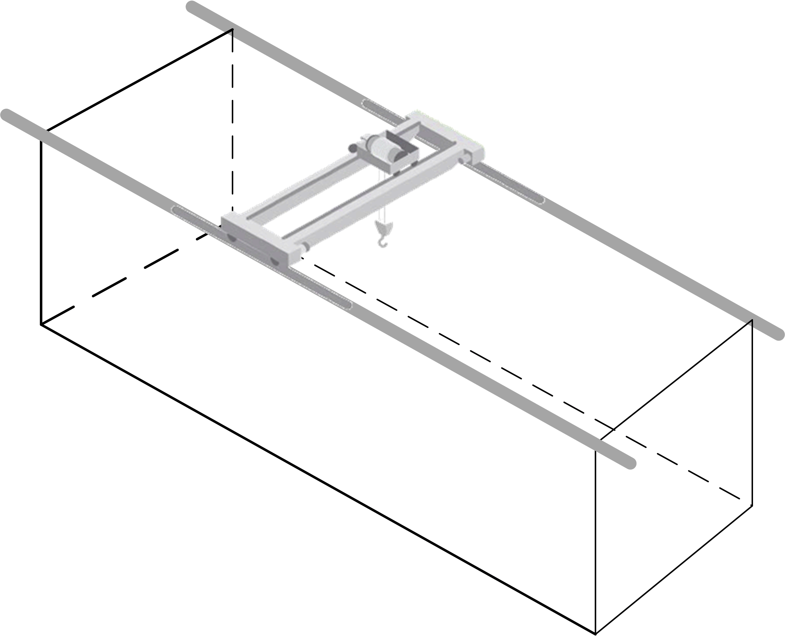
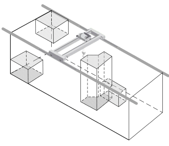

# Function Block Description

Function Block Description

OperatingAreaRestrictionIC Function Block

Pin Diagram

Functional Description

The function block estimates the stopping position of the point corresponding to the position of the hook based on actual positions and speeds of the trolley and the bridge travel. With that, the function block limits movement of the trolley and bridge travel axes in order to prevent the crane from reaching restricted areas. The hoist axis is not controlled by this function block. Sway of the load is not taken in account.

The operating area of an industrial crane with bridge and trolley movements is block shaped. It is defined by the extreme positions of the trolley on the bridge, extreme positions of the bridge on the crane runway and by the height of the hoist.

Restriction of Movement

The function block helps to prevent the lowered hook from entering the restricted areas. Therefore, it tests the estimated stopping position of the center of the trolley against the active restricted areas. The bridge may still move over restricted areas as long as the hoist / trolley do not enter them.

The function block authorizes trolley, bridge travel, and hoist direction commands coming from a crane operator based on position of the crane, cable length, and positions of restricted zones.

Configuration of Parameter List

Number of polygons and number of vertices reserved for one shape is defined by parameters within the Library Manager.

The parameter c\_iNoOfPoly defines the number of available polygonal restricted areas. The minimum allowed value is 1. When it is set to a value lower than 1, the number of polygons is forced to 1.

The parameter c\_iNoOfVert defines the number of vertices available for definition of one restricted area. The minimum allowed value is 3. When it is set to a value lower than 3, the number of vertices is forced to 3.

The setting influences all instances of the function block instantiated within one application. The default configuration defines four polygonal areas with ten vertices per polygon.

These parameters are common for operating area restriction function blocks for both industrial and construction cranes.

Parameters c\_iNoOfCircSegm and c\_iNoOfAnnulSegm are not used by OperatingAreaR­estrictionIC function block.

The system must be thoroughly tested with the maximum number of active restricted areas during commissioning to measure the influence of the number of active restricted areas on the overall performance of the controller. The watchdog of the cyclic task containing execution of this function block must be active.

Definition of number of polygons and vertices per polygon:

Supported Shapes of Restricted Areas

The function block supports polygonal restricted areas. The restricted areas may overlap.

Polygonal restricted areas:

An polygonal restricted area is defined by 3 to 10 vertices. Both monotone and non-monotone polygonal areas are supported.

The vertices of polygons must be taught in the correct order given by edges of the polygon. They can be taught both clockwise and counter-clockwise with the same result.

NOTE: Do not use very acute angles and thin spaces between boundaries of the polygon as depicted in the graph above.

Third Dimension

Areas are defined in a pseudo-3D mode. Each of them allows a definition of a top and a bottom limit. The limits are measured from the topmost position of the hook. When the limits are not defined (are 0), the area is restricted independently from the hook height.

Example of definition of restricted areas in 3D

Teaching the Limits of Restricted Areas

The function block allows teaching of the restricted areas by moving the trolley to positions of the vertices defining the restricted area. The vertices are taught one by one and stored in retained memory in your application, outside of the function block, where they can be read and manipulated.

Activation and Deactivation of Restricted Areas

On top of the activation of the areas based on the actual length of the hoist cable, the restricted areas may be activated and deactivated by your application.

Entering and Leaving the Restricted Area

If the clearance parameter is close to or equal zero, the trolley / hook may enter a restricted area.

The movement inside the restricted area is blocked. If the hoist is still within the distance defined by the margin parameter from the border of the restricted area, the function block allows leaving the restricted area. If the hoist is too deep in the restricted area, it is necessary to override the restriction in order to get out of the area. The margin parameters are defined for bridge and trolley movement.

Visualization of Restricted Areas

The actual position of the crane and the active restricted areas may be visualized on an HMI.

The graphical interpretation of restricted areas and actual crane position is not part of the library.

The visualization can be implemented in your application.

Coordinate System

Movement of the crane bridge corresponds to the X axis and movement of the trolley to the Y axis in Cartesian coordinates.

The position value of both axes must increase in forward direction and decrease in reverse direction.

The function block supports both positive and negative values of crane bridge and trolley positions.

The center of the coordinate system can be within the operating area and the crane can move in the four quadrants. Restricted areas can be also defined anywhere on the plane defined by axes X and Y.

Position of the hoist is the distance of the hook from the topmost position.

Coordinate system, top-down view

Monitoring of Position and Speed Consistency

If the function block has information about linear speed of the axes and nominal speed of the motors, it verifies the consistency between change of positions on linear position inputs and change of position estimated from the motor speed.

If the measured and estimated change of position differs by more than 50%, the function block reports an alarm and stops the movement.

If the function block does not have information about linear speed of the axes and nominal speed of the motors, it verifies only the consistency of direction of position change and motor speed.

EIO0000003890.01

© 2020 Schneider Electric. All rights reserved.