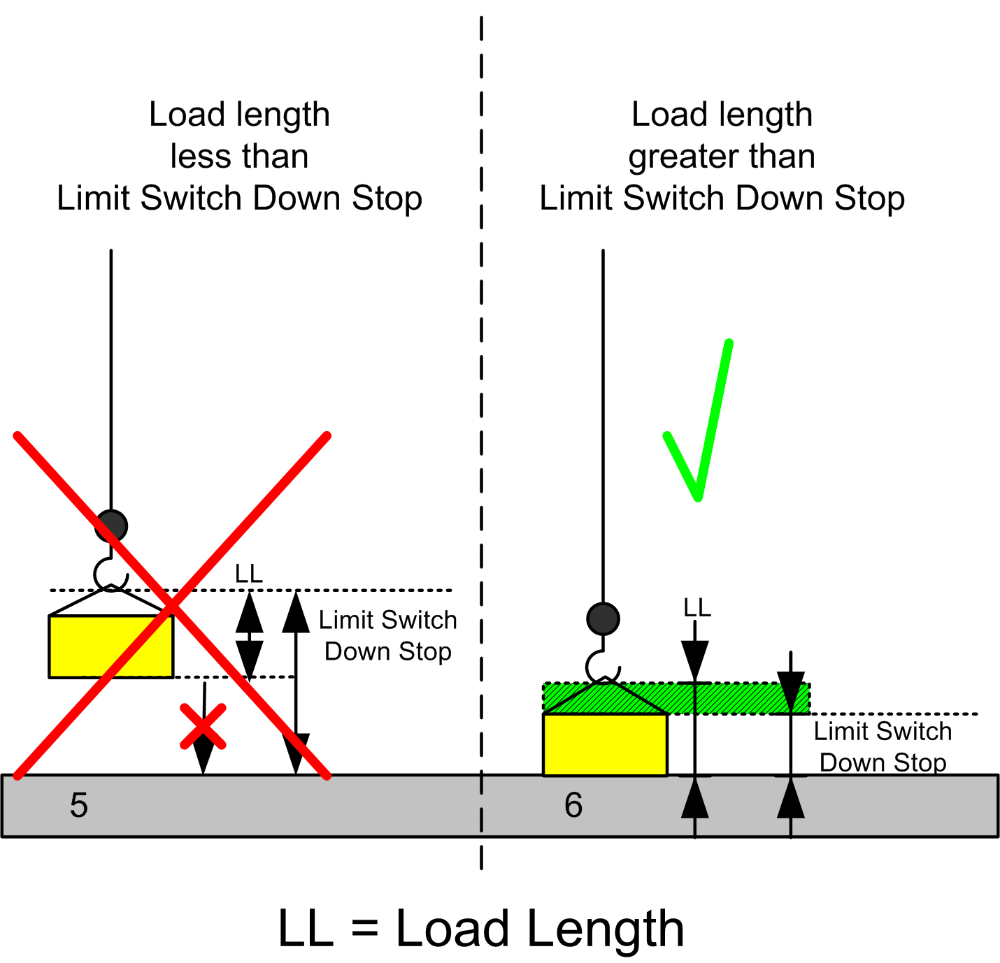

# Functional Overview

Functional Overview

Functional Overview

Functional Description

The Overload control function helps to protect the hoisting equipment from mechanical overload. The function uses the actual torque to detect an overload. In the case of an overload, it stops any ascending motion of the hoist and only allows descent.

The Overload control function is applicable to:

oIndustrial cranes (Hoisting movement)

oConstruction cranes (Hoisting movement)

The Overload control function is designed to be used with Altivar drives.

Considerations for the Configuration

A condition may arise where both upward and downward movement of the load may be prevented due to the hook limit switch down stop position during an overload alarm. To better explain this condition, consider the following scenarios.

Scenario A: Movement with reset by lowering the load on the starting position.

Legend:

| Symbol | Meaning |
| --- | --- |
| G-SE-0011747.1.gif-high.gif | Intended movement |
| G-SE-0011746.1.gif-high.gif | Disallowed movement (restricted by the [AFB](../glossary/glossary.htm#XREF_D_SE_0024697_621)) |
| G-SE-0011748.1.gif-high.gif | Movement done |

1. The operator wants to move a load from a higher position to the ground.

2. After lifting the load up, the Overload alarm is signaled. A continued up movement is no longer possible.

3. The load is set back on the starting position and the Overload alarm is reset.

Scenario B: Movement with moving the load to the side and attempting to the ground.

Legend:

| Symbol | Meaning |
| --- | --- |
| G-SE-0011747.1.gif-high.gif | Intended movement |
| G-SE-0011746.1.gif-high.gif | Disallowed movement (restricted by the AFB) |
| G-SE-0011748.1.gif-high.gif | Movement done |

1. The operator wants to move a load from a higher position to the ground.

2. After lifting the load up, the Overload alarm is signaled. A continued up movement is no longer possible.

3. The load is moved to the side to lower it down to the ground.

4. The load is lowered beneath the starting level. The AFB still maintains the alarm and does not allow an up movement.

If the Hook reaches the Limit switch for the down movement, before lowering the load onto the ground, the operator can not move the load either up or down. The AFB limits upward movement of the load due to the Overload alarm, and the Limit switch does not allow further downward movement. The load, which is overloading the crane, is suspended and the operator can not move it.

To prevent this condition, you must make sure that the load length is greater than the distance imposed by the Limit Switch Down Stop:

5. A high limit switch position for the Hook down stop movement could block either upward or downward movement of the load.

6. To prevent this condition, the load length must be greater than the limit switch for down stop movement level.

|  |
| --- |
| Warning_Color.gifWARNING |
| PROLONGED SUSPENSION OF AN OVERLOAD |
| Ensure that the configuration of the mechanical limit switch down stop does not prevent any load from being positioned on the ground. |
| Failure to follow these instructions can result in death, serious injury, or equipment damage. |

Three Methods to Detect and Reset an Overload

The Overload control solution involves 3 methods that detect overload by torque and reset in 3 different ways:

oOverload reset using the torque method

oOverload reset using the distance method

oOverload reset using the encoder method

Why Use the Overload Control Function

The Overload control helps in protecting hoisting machinery by detecting mechanical overload and stopping the device before any damage can occur. The function block provides monitoring of potential overload conditions. If an overload condition is indicated, upward movement of the hoist must be prevented by the crane control commands and only downward movement should be allowed until the overload condition is corrected.

This function block is intended to have significant influence on the physical movement of the crane and its load. The application of this function block requires accurate and correct input parameters in order to make its movement calculations valid and to avoid hazardous situations. If invalid or otherwise incorrect input information is provided by the application, the results may be undesirable.

|  |
| --- |
| Warning_Color.gifWARNING |
| UNINTENDED EQUIPMENT OPERATION |
| Validate all function block input values before and while the function block is enabled. |
| Failure to follow these instructions can result in death, serious injury, or equipment damage. |

Solution with the Overload Control Function

The actual load at the motor is derived from the torque at the drive. This torque is used for Overload control function block. Detected overload are reset using the torque, encoder feedback, or distance traveled.

Design & Realization Constraints and Assumptions

It is assumed that when the motor moves in forward direction, the hoist moves up and when the motor moves in reverse direction, the hoist moves down. It is necessary that the encoder produces ascending pulses when hoist moving up and descending pulses when the hoist moves down.

Functional View

EIO0000003890.01

© 2020 Schneider Electric. All rights reserved.