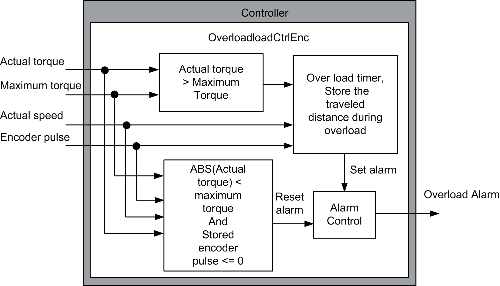

# Software Architecture

Software Architecture

DataFlow Overview - Overload Control Torque Method

In this overload control torque method, when the actual torque is greater than or equal to the maximum torque for a period of time defined by the user an overload alarm is generated. The overload alarm will only reset when the actual torque is less than the hook torque and the hoist is moving down.

DataFlow Overview - Overload Control Distance Method

In this overload control distance method, when the actual torque is greater than the maximum torque for a period of time defined, an overload alarm is generated.

Distance traveled = Distance traveled + Actual speed (RPM) \* (Controller scan time (ms) /60000)

The overload alarm will only reset when the actual torque is less than the maximum torque and the distance traveled under overload is less than or equal to zero.

DataFlow Overview - Overload Control Encoder Method

In this overload control encoder method, the encoder connected to the hoist motor is used as a feedback to store the distance traveled under overload condition. When the actual torque is greater than the maximum torque for a period of time defined, an overload alarm is generated.

The overload alarm will only reset when the actual torque is less than the maximum torque, and the distance traveled under overload is less than or equal to zero.

EIO0000003890.01

© 2020 Schneider Electric. All rights reserved.