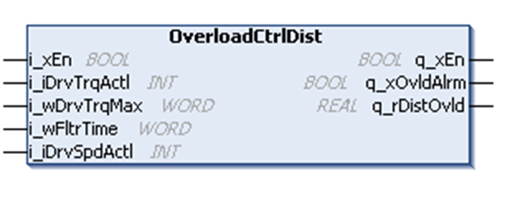

# OverloadCtrlDist Function Block

OverloadCtrlDist Function Block

Pin Diagram

Function Block Description

The distance method is based on the actual position of the hoist. If the actual torque is greater than to the preset maximum value i\_wDrvTrqMax, a timer is started and the distance moved is calculated using the formula:

Distance = (Actual speed of drive \* Cycle Time) + Distance

When the time delay expires, the overload alarm is activated and upward movement is blocked. The load must now be lowered until the calculated distance is less than or equal to zero and the absolute value of the torque value is less than the maximum allowed value i\_wDrvTrqMax.

Timing Chart

NOTE: This timing chart does not describe the real behavior of the movement.

EIO0000003890.01

© 2020 Schneider Electric. All rights reserved.