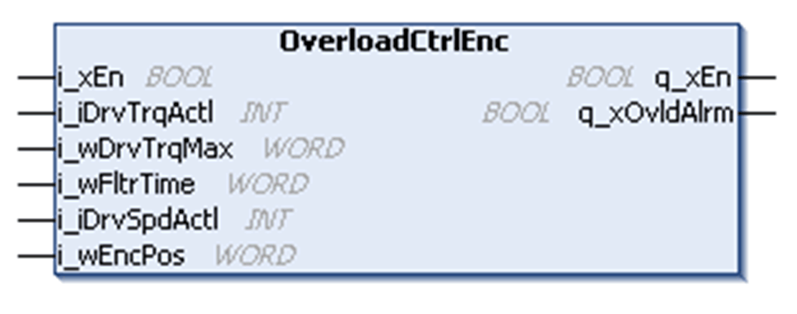
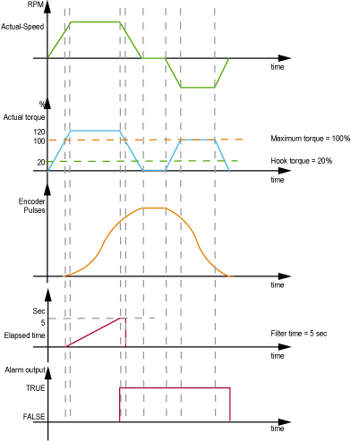

# OverloadCtrlEnc Function Block

OverloadCtrlEnc Function Block

Pin Diagram

Function Block Description

The encoder method utilizes the actual encoder value on the motor. If the actual torque is greater than or equal to the preset maximum value i\_wDrvTrqMax, a timer is started and the current encoder value is stored. Once the time delay expires the overload alarm is activated and upward movement is blocked. The load must now be lowered until the encoder value drops below the stored value and the absolute value of torque value is lower than the maximum allowed value i\_wDrvTrqMax.

Timing Chart

NOTE: This timing chart does not describe the real behavior of the movement.

EIO0000003890.01

© 2020 Schneider Electric. All rights reserved.