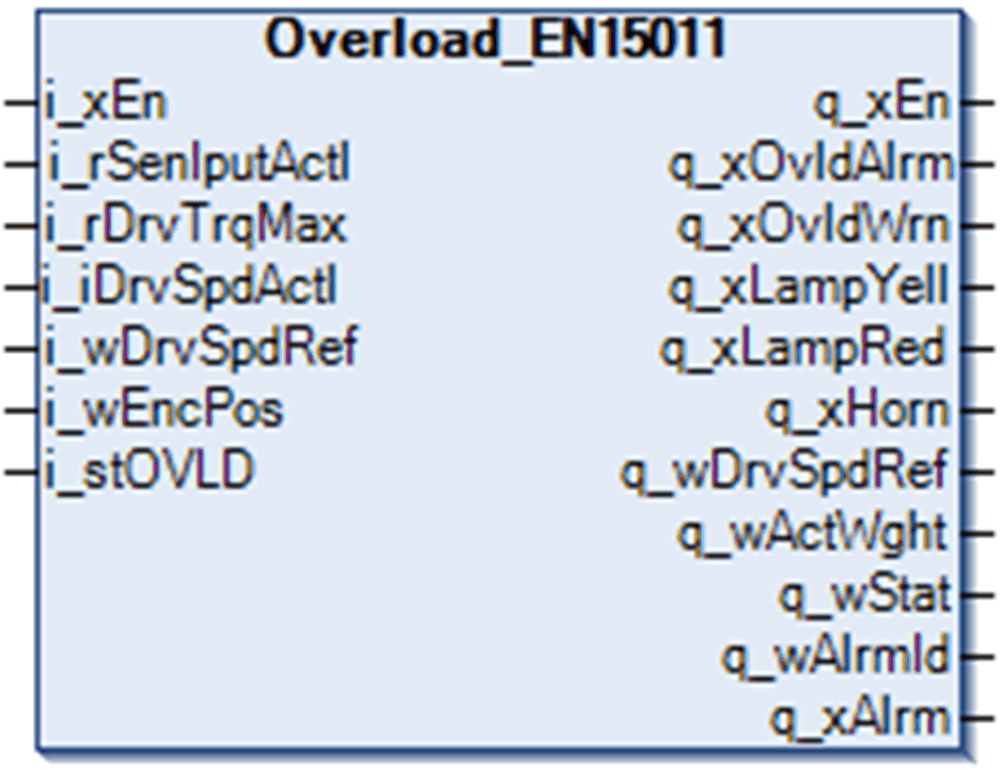

# Function Block Description

Function Block Description

Overload\_EN15011 Function Block

Pin Diagram

Function Block Description

If a calibration has not been done and the maximum torque override input i\_rDrvTrqMax is zero, the maximum torque is set to 30% by default.

EIO0000003890.01

© 2020 Schneider Electric. All rights reserved.