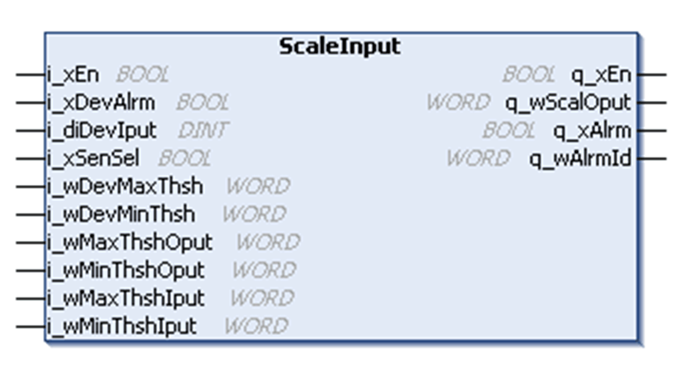

# Function Block Description

Function Block Description

ScaleInput Function Block

Pin Diagram

Function Block Description

This function scales an analog or counter input from a device to a desired output range.

The ScaleInput function block allows to change incoming sensor or encoder WORD input to a scaled WORD value for application that needs it.

The input value is monitored to check that it is within the scaled parameters; otherwise an alarm signal is generated. An alarm signal can also be generated if the function block receives an indication that the device generating the analog input signal is not functioning correctly. Alarm bit 2 indicates that the input signal is below the low input limit and alarm bit 3 indicates the input signal is above high input limit.

EIO0000003890.01

© 2020 Schneider Electric. All rights reserved.