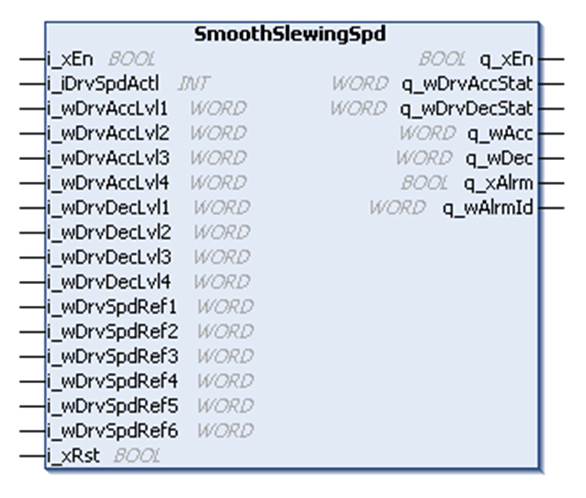
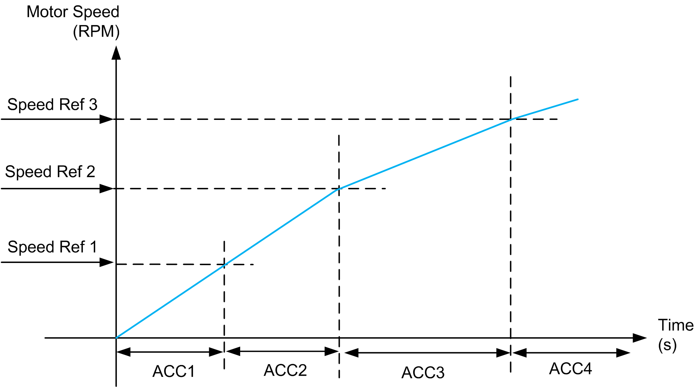

# SmoothSlewingSpd Function Block

SmoothSlewingSpd Function Block

Pin Diagram

Function Block Description

This function block changes the acceleration and deceleration time parameters based on the actual speed of the motor.

Acceleration Parameter

During acceleration, the acceleration parameter is selected from 4 pre-defined acceleration values (ACC1, ACC2, ACC3 and ACC4) as the actual speed reaches the threshold (speed1, speed2 and speed3 respectively).

| Comparing Actual Speed with Defined Speed | Acceleration Value |
| --- | --- |
| i\_iDrvSpdActl >= i\_wDrvSpdRef3 | i\_wDrvAccLvl4 |
| i\_iDrvSpdActl >= i\_wDrvSpdRef2 | i\_wDrvAccLvl3 |
| i\_iDrvSpdActl >= i\_wDrvSpdRef1 | i\_wDrvAccLvl2 |
| None of the above condition holds good then | i\_wDrvAccLvl1 |

Example:

If Spd1 = 500 RPM, Spd2 = 1000 RPM, Spd3 = 1500 RPM (that is, Spd1 < Spd2 < Spd3) then:

| If actual speed is between... | Then acceleration is... |
| --- | --- |
| 0 and 500 RPM, | ACC1 |
| 500 and 1000 RPM, | ACC2 |
| 1000 and 1500 RPM, | ACC3 |
| 1500 and HSP RPM, | ACC4 |

NOTE: You must set speed levels such that Spd1< Spd2< Spd3 to give a four slope acceleration curve. If less than four levels of acceleration are required, the values for ACC2, ACC3 and ACC4 should be set to the same value.

Deceleration Parameter

During deceleration, the deceleration parameter is selected from four pre-defined deceleration values (DEC1, DEC2, DEC3 and DEC4), as the actual speed reaches threshold (speed4, speed5 and speed6 respectively).

| Comparing Actual Speed with Defined Speed | Deceleration Value |
| --- | --- |
| i\_iDrvSpdActl >= i\_wDrvSpdRef4 | i\_wDrvDecLvl1 |
| i\_iDrvSpdActl >= i\_wDrvSpdRef5 | i\_wDrvDecLvl2 |
| i\_iDrvSpdActl >= i\_wDrvSpdRef6 | i\_wDrvDecLvl3 |
| None of the above condition holds good then | i\_wDrvDecLvl4 |

Example:

If Spd4 = 1500 RPM, Spd5 = 1000 RPM, and Spd6 = 500 RPM (that is, Spd4 > Spd5 > Spd6) then:

| If actual speed is between... | Then deceleration is... |
| --- | --- |
| 1500 and HSP RPM, | DEC1 |
| 1000 and 1500 RPM, | DEC2 |
| 500 and 1000 RPM, | DEC3 |
| 0 and 500 RPM, | DEC4 |

NOTE: You must set Speed levels such that Spd4>Spd5>Spd6 to get a three slope deceleration curve. If less than four levels of deceleration are required, the values for DEC2, DEC3 and DEC4 should be set the same.

EIO0000003890.01

© 2020 Schneider Electric. All rights reserved.