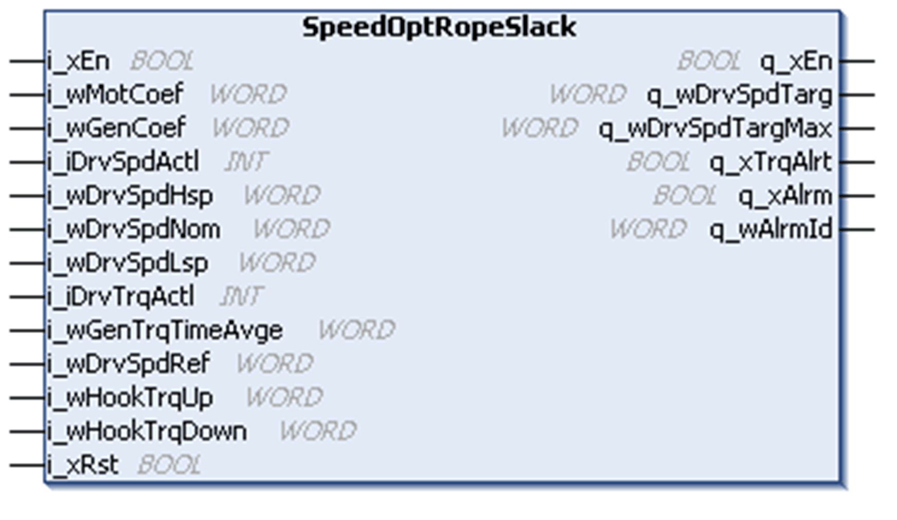
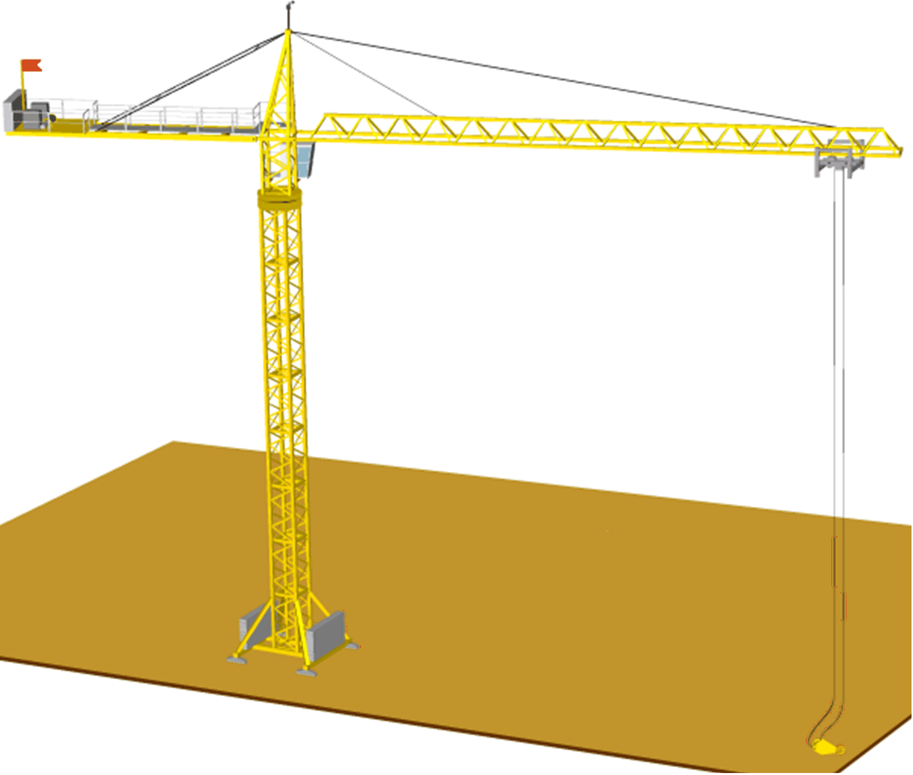

# SpeedOptRopeSlack Function Block

SpeedOptRopeSlack Function Block

Pin Diagram

Function Block Description - Speed Optimization

When the speed reference is greater than or equal to the nominal speed and the actual torque is above 70% of the hook torque, the function block calculates the optimized speed.

NOTE: Nominal torque is equal to 100% considered inside the function block.

Calculation of Optimized Speed During Motor Mode

Formula for calculating optimized speed during motor mode:

Optimized Speed = (Nominal speed in RPM) \* (Nominal torque in percentage / (Measured torque in percentage) \* (Motor coefficient in percentage)

Example:

During Motor operation

Nominal speed = 1500 RPM

Actual torque = 50%

Motor coefficient = 40%

Optimized speed (RPM) = 1500 \* (100 / 50) \* (40 / 100)

Optimized speed = 1200 RPM

Calculation of Optimized Speed During Generator Mode

Formula for calculating optimized speed during generator mode:

You have the facility to use the following two modes:

oDynamic torque calculation

In this mode, the Optimized speed is calculated using the actual torque continuously.

Optimized Speed = (Nominal speed in RPM) \* (Nominal torque in percentage/(Measured torque in percentage) \* (Generator coefficient in percentage)

Example:

During Generator operation

Nominal speed = 1500 RPM

Actual torque = 25%

Generator coefficient = 50%

Optimized speed (RPM) = 1500 \* (100 / 25) \* (50 / 100)

Optimized = 3000 RPM

oAveraged torque calculation

In this mode, the actual torque is averaged over a user defined period of time. When the actual speed is greater than or equal to 90% of nominal speed, the optimized speed is calculated using this averaged torque.

This torque is recalculated when the drive is stopped or there is a change in direction of the hoist.

Example:

During Generator operation

Nominal speed = 1500 RPM

Measured averaged torque = 20%

Generator coefficient = 50%

Optimized speed (RPM) = 1500 \* (100/20) \* (50/100)

Optimized = 3750 RPM

Function Block Description - Rope Slack

The Rope slack function is used to keep track of the actual load on the drive or motor and helps to avoid any slack that may occur in the hoisting rope when the load is set on the ground.

NOTE:

The function block is defined with two distinct inputs for hook torque:

oHook torque up

oHook torque down

The hook torque up is considered when the hoist is moving up and hook torque down is considered when the hoist is moving down.

The Rope slack function is activated when the actual torque goes below or equal to 70% of the hook torque up value when the hoist is moving up.

The Rope slack function is activated when the actual torque goes below or equal to 70% of the hook torque down value when the hoist is moving down.

EIO0000003890.01

© 2020 Schneider Electric. All rights reserved.