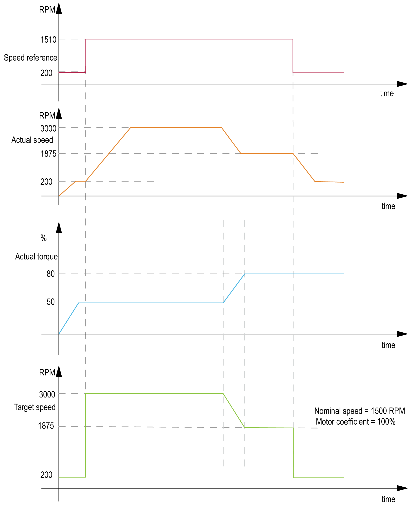

# Timing Chart

Timing Chart

Hoist Moving Up

Hoist Moving Down and Dynamic Measurement Activated

Hoist Moving Down and Average Torque Measurement Activated

Hoist Moving Down-Response of Speed on the Change of Motor and Generator Coefficient

NOTE: The timing diagram does not depict the real performance of the hoist.

EIO0000003890.01

© 2020 Schneider Electric. All rights reserved.