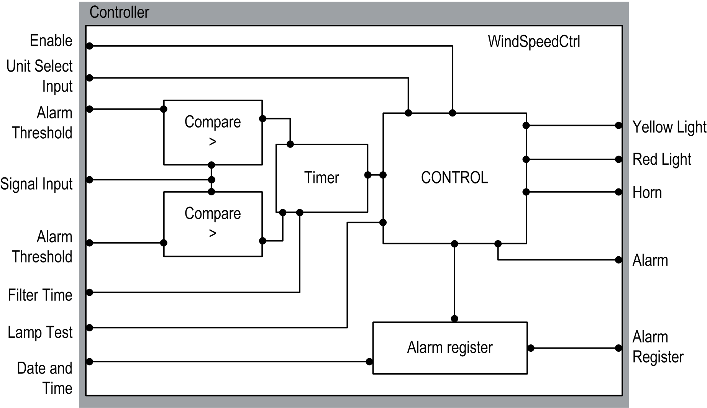

# Software Architecture

Software Architecture

Software Architecture Overview

The WindSpeedCtrl function block monitors the output signal of an anemometer.

If the actual wind speed value is greater than the set parameter, an alert or alarm is generated (yellow light and/or red light and horn).

If the function is set to imperial units (i\_xUnitSel input is TRUE), the maximum alert value is 31MPH and the maximum alarm value is 45 MPH. If the function is set to metric units (i\_xUnitSel input is FALSE), the maximum alert value is 50 km/h and the maximum alarm value is 72 km/h. These limits cannot be exceeded; if greater values are entered, the values are not accepted, and the limits are set to the maximum alert values.

The maximum value of the delay time (i\_wFltrTime) is limited to 20 sec. This is the time over which a certain wind speed must be monitored before an alert and/or alarm is given, thus filtering out short gusts of wind.

Data Flow Overview

EIO0000003890.01

© 2020 Schneider Electric. All rights reserved.