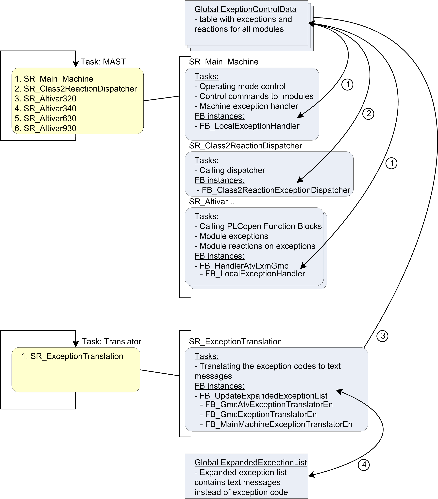

# Task Configuration

Task Configuration

Overview

The [task](../glossary/glossary.htm#XREF_D_SE_0024697_175) configuration of the application example contains beside the default task MAST one additional task Translator.

The graphic provides an overview about the different tasks and the associated program calls.

| Pos. | Description |
| --- | --- |
| 1 | Exceptions and reactions are exchanged through the global exception control data |
| 2 | The reaction dispatcher monitors the exceptions and distributes the reactions |
| 3 | Translator reads the exceptions from the global list |
| 4 | Translator creates an expanded exception list which provides plain text messages |

EIO0000002823.00

© 2019 Schneider Electric. All rights reserved.