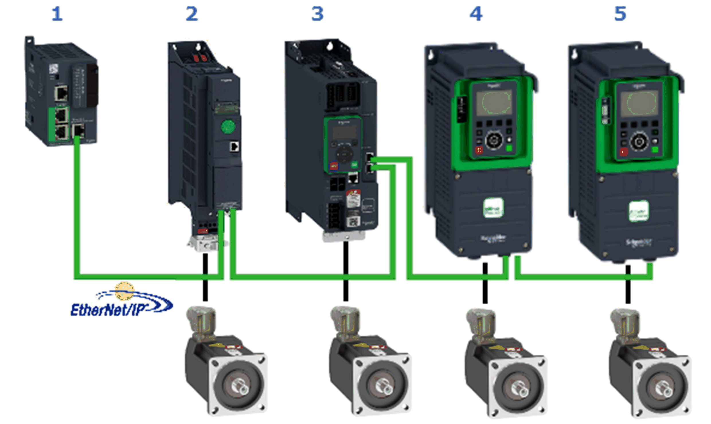

# Hardware Configuration

Hardware Configuration

Overview of the Hardware Configuration

Overview of the Hardware Configuration

The project example implements a Modicon M251 Logic Controller and the four different Altivar variable speed drives. The Altivar drives are linked to the controller via EtherNet/IP fieldbus as EtherNet/IP targets. The controller is the EtherNet/IP scanner and implements the logic to control and monitor the drives over the fieldbus.

The figure presents the layout of the network:

| Item | Description |
| --- | --- |
| 1 | Modicon M251 Logic Controller |
| 2 | Altivar ATV320 equipped with the communication module VW3A3616 |
| 3 | Altivar ATV340E with embedded Ethernet board |
| 4 | Altivar ATV630 equipped with the communication module VW3A3720 |
| 5 | Altivar ATV930 with embedded Ethernet board |

Hardware Configuration Procedure

| Step | Action | Comment |
| --- | --- | --- |
| 1 | In the Devices tree, double-click the Ethernet interface and configure the parameter in the device editor. | Configure the IP parameter and activate the DHCP server. |
| 2 | In the Devices tree, add the Industrial Ethernet Manager under the Ethernet interface of the controller. | Execute the Add Device … command from the contextual menu of the Ethernet interface. In the Add Device dialog box, double-click the Industrial Ethernet Manager to add it to the project. |
| 3 | Select the Industrial Ethernet Manager node in the Devices tree. | The Add Device dialog box is updated and lists the devices which can be added. |
| 4 | Double-click the EtherNet/IP target Altivar 320 to add it under the Industrial Ethernet Manager node. | – |
| 5 | Double-click the EtherNet/IP target Altivar 340 to add it under the Industrial Ethernet Manager node. | – |
| 6 | Double-click the EtherNet/IP target Altivar 6xx to add it under the Industrial Ethernet Manager node. | – |
| 7 | Double-click the EtherNet/IP target Altivar 9xx to add it under the Industrial Ethernet Manager node. | – |
| 8 | Close the Add Device dialog box. | – |
| 9 | In the Devices tree, double-click the Industrial Ethernet Manager node and select the tab Network Manager in the open device editor. | In the table, you can configure the communication parameter for the Ethernet devices under the Industrial Ethernet Manager node. |

EIO0000002825.00

© 2019 Schneider Electric. All rights reserved.