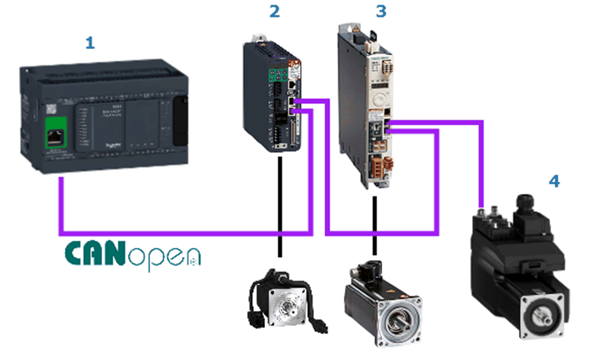

# Hardware Configuration

Hardware Configuration

Overview of the Hardware Configuration

Overview of the Hardware Configuration

The project example implements a Modicon M241 Logic Controller and the three different Lexium servo drives: Lexium 28, Lexium 32A and integrated Lexium 32i. The Lexium drives are linked to the controller via [CANopen](../glossary/glossary.htm#XREF_D_SE_0024697_650) fieldbus as [CANopen](../glossary/glossary.htm#XREF_D_SE_0024697_650) slaves. The controller is the CANopen master and implements the logic to control and monitor the drives over the fieldbus.

The figure presents the layout of the network:

| Item | Description |
| --- | --- |
| 1 | Modicon M241 Logic Controller |
| 2 | Lexium 28 |
| 3 | Lexium 32A |
| 4 | Integrated Lexium 32i |

EIO0000002824.00

© 2019 Schneider Electric. All rights reserved.