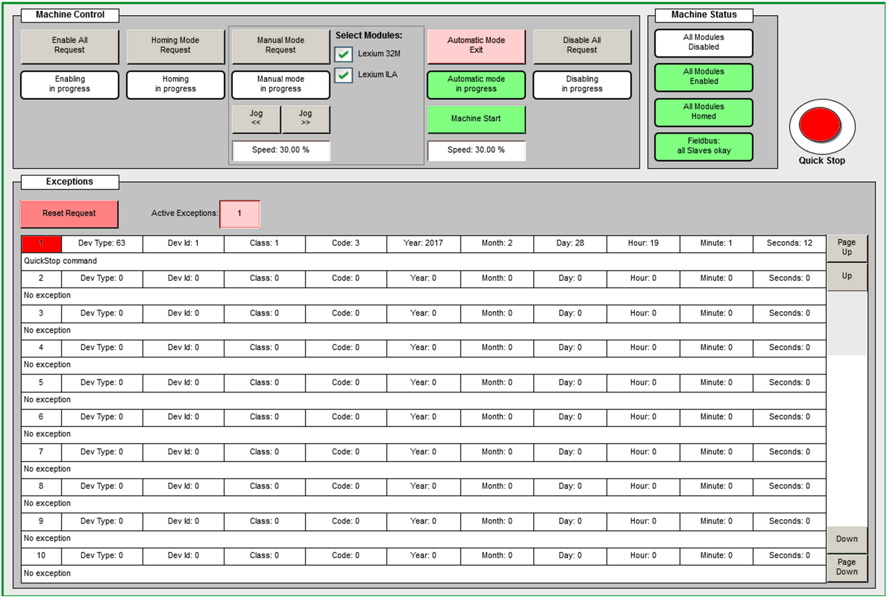

# Visualization

Visualization

Visualization Screen

Overview

The application example implements a EcoStruxure Machine Expert visualization to control and to monitor the application. The visualization is available as web visualization.

The web visualization offers you access to machine control functions over the network. To help prevent unauthorized access to your machine control, implement the following technical and organizational measurements for the system running your application.

|  |
| --- |
| Warning_Color.gifWARNING |
| UNAUTHENTICATED, UNAUTHORIZED ACCESS |
| oDo not expose controllers and controller networks to public networks and the Internet as much as possible.  oUse additional security layers such as VPN for remote access and install firewall mechanisms.  oRestrict access to authorized personnel by activation and deployment of the user management of the controller and the visualization.  oChange default passwords at start-up and modify them frequently.  oValidate the effectiveness of these measurements regularly and frequently. |
| Failure to follow these instructions can result in death, serious injury, or equipment damage. |

Visualization Screen - VisuMainMachine

A general overview and a main control panel are provided on the visualization screen VisuMainMachine.

In addition, for each Lexium module a separate visualization screen is implemented. These visualization screens provide extensive control functions which can be used during commissioning phase.

EIO0000002826.00

© 2019 Schneider Electric. All rights reserved.