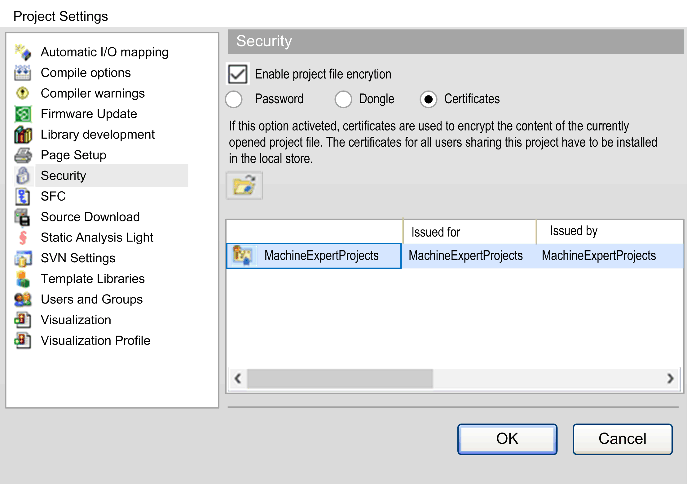

# Activating the Certificates Option in the Project Settings > Security Dialog Box

Activating the Certificates Option in the Project Settings > Security Dialog Box

| Step | Action |
| --- | --- |
| 1 | Open the EcoStruxure Machine Expert project you want to encrypt. |
| 2 | Execute the Project > Project Settings command, and select the Security [dialog box](../../../../../../api/crossBook?lang=en-US&virtualBookName=SoMMenu&topicID=D_SE_0083955_1).  Alternatively, click the G-SE-0079540.1.png button from the Project file encryption section of the View > Security Screen [editor](../../../../../../api/crossBook?lang=en-US&virtualBookName=SoMMenu&topicID=D_SE_0099371_11) to open the Project > Project Settings > Security dialog box. |
| 3 | Activate the Enable project file encryption option. |
| 4 | Activate the Certificates option. |

The graphic indicates the Project Settings > Security dialog box with Certificates option selected:

