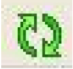
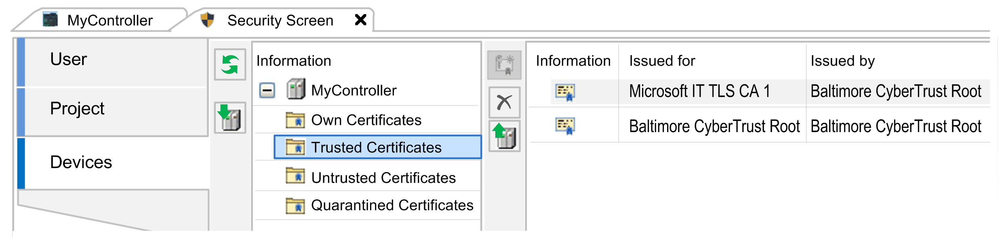

# Managing Certificates on the Controller

## Overview

If the client or server is configured to verify the certificate of the communication partner in mode TrustedOnly, the corresponding certificate must be available on the controller and it must be declared as trusted. To achieve this, use the editor Security Screen in EcoStruxure Machine Expert Logic Builder to manage the certificates on your controller.

## Security Screen Editor

The Security Screen editor is available in EcoStruxure Machine Expert Logic Builder via the View > Security Screen command. The Devices tab of the Security Screen editor provides access to the folders that are dedicated to managing certificates on the connected controller.

Click the  button to display the corresponding folders and their content for the certificate handling on the connected controller.

For example, the following categories are available for the Modicon M262 Logic/Motion Controller:

* Own Certificates: Certificates owned by the controller which are used for associated services it provides.
* Trusted Certificates: Certificates that have been created by a trusted certificate source.
* Untrusted Certificates: Certificates that you have declared as untrusted.
* Quarantined Certificates: Certificates that do not meet the criteria of the other categories.

Successful verification of a certificate in mode TrustedOnly is only possible if the corresponding certificate(s) are available in the folder Trusted Certificates.

## Declare a Certificate as Trusted

In order to declare certificates as trusted on your controller, perform the following steps:

| Step | Action | Comment |
| --- | --- | --- |
| 1 | Save the certificate of a device / software that you received from the manufacturer to your PC running EcoStruxure Machine Expert. | If you did not receive a certificate from the manufacturer of your device / software, you can obtain it by trying to establish a connection as described in the paragraph [*Obtaining an Unknown Certificate*](#D-SE-0096333__D-SE-0096333.3). |
| 2 | Double-click the certificate.  **Result**: The Certificate dialog box opens. | – |
| 3 | Inspect the certificate carefully in the General tab and decide whether you want to declare it as trusted. | – |
| 4 | Select the Certification Path tab and verify whether there is only one entry. | If there is only one entry in the Certification Path tab, then this is a self-signed certificate, as for example, for the Modicon M262 Logic/Motion Controller. You can skip the next two steps and proceed with step 7.  If there is a tree structure in the Certification Path tab, then this certificate has been signed by a CA (Certificate Authority). In this case, perform the following steps for CA certificates. |
| 5 | If the certificate has been signed by a CA: Verify each certificate from the tree structure including the root CA certificate from the Certification Path tab. | – |
| 6 | For each CA certificate of the Certification Path, select the certificate and click the View Certificate button.  **Result**: A new dialog box opens for the selected certificate. | – |
| 7 | Select the Details tab and click the Copy to file... button to save the certificate on the PC. | – |
| 8 | Download the saved certificate files to the Trusted Certificates folder of your controller. | For successful certificate verification during the next connection attempt either the received certificate itself or at least one certificate of the Certification Path (chain of trust) must be declared as trusted.  Refer to the paragraph [*Downloading Certificate(s) Declared as Trusted to the Controller*](#D-SE-0096333__D-SE-0096333.6). |

## Downloading Certificate(s) to the Controller

To save certificates that you have declared as trusted to the folder Trusted Certificates on your controller, proceed as follows:

| Step | Action |
| --- | --- |
| 1 | In EcoStruxure Machine Expert Logic Builder, execute the Security Screen editor from the View menu. |
| 2 | In the Security Screen editor, select the Devices tab. |
| 3 | Click the button Refresh the list of available devices and their certificate stores.  **Result**: The display is updated according to the information received from the connected controller. |
| 4 | Select the folder Trusted Certificates, and click the Download button. |
| 5 | In the Open dialog box, navigate to the folder on your PC running EcoStruxure Machine Expert where you saved the certificate file(s). |
| 6 | Select the certificate file(s) and click the Open button.  **Result**: The certificates are downloaded to the controller and are displayed on the right-hand side of the Security Screen editor as content of the folder Trusted Certificates. |

## Obtaining an Unknown Certificate

If the certificate of a communication partner is not available and you cannot obtain it from the manufacturer or another source, proceed as follows:

| Step | Action | Further information |
| --- | --- | --- |
| 1 | Establish a secured connection with etCertVerifyMod set to TrustedOnly between the client and the server:   * If your application implements a client, connect to the server. * If your application implements a server, open the server and accept the incoming connection from the client.   **Results**:   * As the certificate that has been sent by the server or client is unknown, the connection cannot be established. * The unknown certificate is stored in the folder Quarantined Certificates on your controller. | * If your controller application implements a client, the result ConnectionFailed may indicate that the certificate that has been received from the server is unknown. * If your controller application implements a server, the result TlsError may indicate that the certificate that has been received from the client is unknown.   NOTE: If the folder is empty, the communication partner may have not sent its certificate. Verify the configuration of the remote server or client in order to find out whether a certificate can be expected. |
| 2 | In EcoStruxure Machine Expert Logic Builder, open the Security Screen editor and click the button Refresh the list of available devices and their certificate stores. | – |
| 3 | Select the folder Quarantined Certificates. | – |
| 4 | Select the certificate from the list on the right-hand side of the Security Screen editor, and click the Upload the selected certificate from the device and save it to your PC button. | |
| 5 | In the Save as dialog box, navigate to a folder on your PC running EcoStruxure Machine Expert where you want to save the certificate file(s) and click the Save button. | – |
| 6 | Verify the certificate(s) and decide if you want to declare them as trusted as described in the paragraph [*How to Obtain Trusted Certificates*](#D-SE-0096333__D-SE-0096333.9). | – |
| 7 | [Download the certificate(s) declared as trusted to the controller](#D-SE-0096333__D-SE-0096333.6). | – |

EIO0000003897.01

© 2021

Schneider Electric.

All rights reserved.