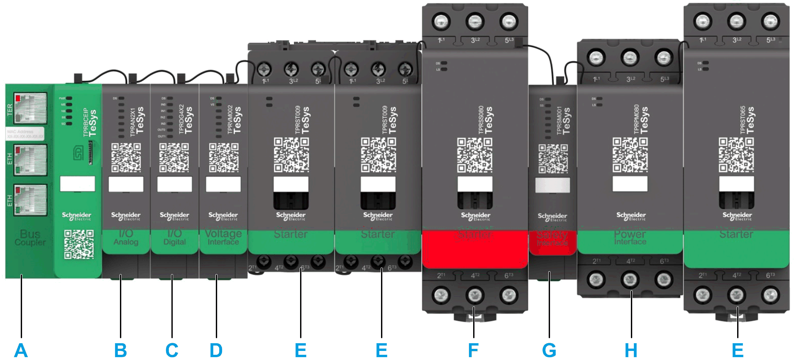

# General Information

General Information

Overview

This document describes the steps required in EcoStruxure Machine Expert for creating a project with a TeSys™ island and a logic/motion controller by using the EtherNet/IP or Modbus TCP protocol.

oIntegrating the TeSys™ island into the EcoStruxure Machine Expert project.

oAccessing the TeSys™ island DTM (Device Type Manager) via EcoStruxure Machine Expert for configuring the TeSys™ island modules and processes by using avatars.

oUsing the function blocks of the TeSys island library that is available in EcoStruxure Machine Expert for developing applications and to control avatar modules.

System Requirements

The following components are required for communication via EtherNet/IP or Modbus TCP:

| Component | Type and Version |
| --- | --- |
| Software | EcoStruxure Machine Expert V1.1 or later |
| Controller | oTM241CE••• logic controller supporting EtherNet/IP and Modbus TCP/IP  oTM251MESE logic controller supporting EtherNet/IP and Modbus TCP/IP  oTM262L10/20 logic controller  oTM262M15/25/35 motion controller |

Overview of the TeSys™ island Concept

TeSys™ island describes an open, modular distributed input/output system comprising different modules residing on a DIN rail backplane:

A   Bus coupler

B   Analog input / output module

C   Digital input / output module

D   Voltage interface module

E   Standard starter

F   SIL (Safety Integrity Level) starter

G   SIL interface module

H   Power interface module

The entire TeSys™ island acts as a node in a fieldbus network. The bus coupler is the core module that provides internal communication with the TeSys™ island modules via ribbon cables and external communication via EtherNet/IP or Modbus TCP. For further information, refer to the TeSysTM island System Guide.

The integration of this bus coupler as a TeSys™ island communication node in your EcoStruxure Machine Expert project is described in the next topic [Integrating the TeSys™ island into the EcoStruxure Machine Expert Project](ESME_-_How_to_Use_a_TeSys_Island-2.htm#XREF_D_SE_0094907_1).

EIO0000003861.00

© 2019 Schneider Electric. All rights reserved.