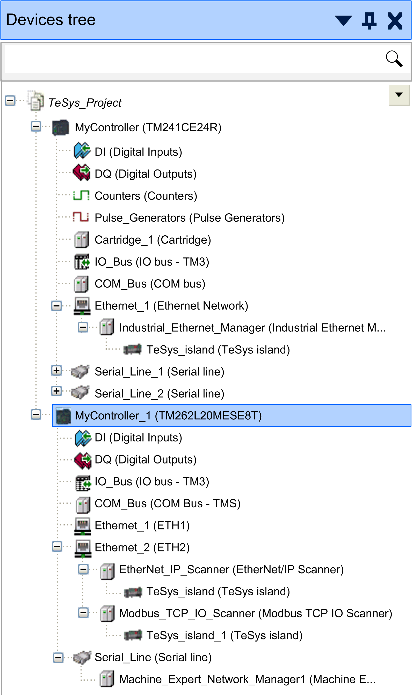

# How to Add the TeSys™ island to the EcoStruxure Machine Expert Project

How to Add the TeSys™ island to the EcoStruxure Machine Expert Project

As the bus coupler acts as a single communication node for the complete TeSys™ island, you have to add the bus coupler as communication node to your EcoStruxure Machine Expert project.

| Step | Action | Comment |
| --- | --- | --- |
| 1 | Create or open your EcoStruxure Machine Expert project. | – |
| 2 | Add a controller supporting EtherNet/IP or Modbus TCP/IP from the Hardware Catalog > Controller to your project.  Result: A controller node is added to the Devices tree with several subnodes. | For further information, refer to the chapter [Adding Devices by Drag and Drop in the Programming Guide](../../../../../../api/crossBook?lang=en-US&virtualBookName=SoMProg&topicID=D_SE_0083369_3). |
| 3 | From the hardware catalog, select the following communication manager, depending on the controller you use:  oFor M241 or M251 controllers, select Industrial Ethernet Manager.  oFor M262 controllers, select EtherNet/IP Scanner or Modbus TCP IO Scanner depending on whether EtherNet/IP or Modbus TCP scanner services are required.  Result: The selected communication manager is added as a subnode below the Ethernet node in the Devices tree. | For further information, refer to the chapter [Adding Communication Managers in the Programming Guide](../../../../../../api/crossBook?lang=en-US&virtualBookName=SoMProg&topicID=D_SE_0083373_1). |
| 4 | Right-click the communication manager subnode, and execute the command Add Device to add a TeSys island element.  Result: A TeSys\_island subnode is added below the selected communication manager node in the Devices tree. | For further information, refer to the chapter [Adding Devices to a Communication Manager in the Programming Guide](../../../../../../api/crossBook?lang=en-US&virtualBookName=SoMProg&topicID=D_SE_0083374_1). |

The figure illustrates the TeSys\_island configuration in the Devices tree for M241 and M262 controllers:

