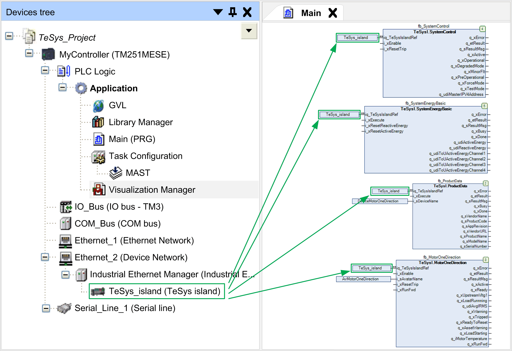

# Referencing the TeSys™ island Bus Coupler from the Function Blocks

Referencing the TeSys™ island Bus Coupler from the Function Blocks

A reference to the TeSys™ island bus coupler is required by each function block of the TeSys island library. To achieve this, configure the name you assigned to the TeSys\_Island node in the Devices tree as input iq\_TeSysIslandRef of the function blocks.

