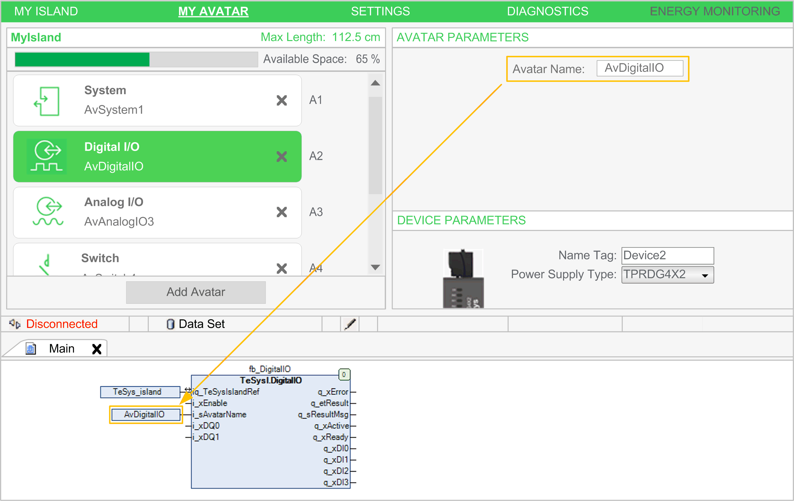
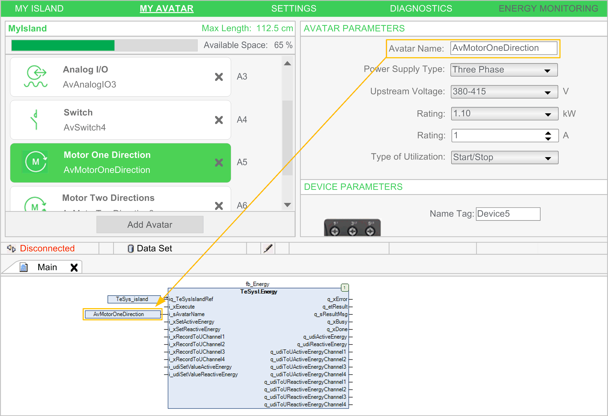
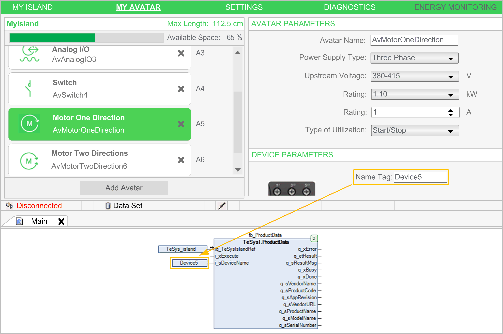
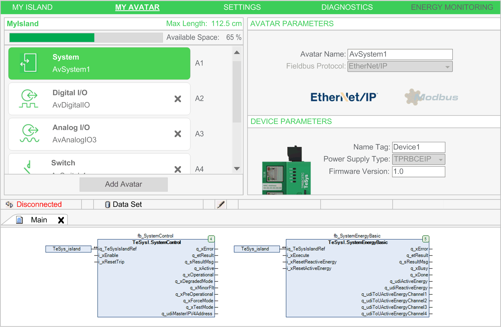

# Using the TeSys island Library for Developing Applications

Using the TeSys island Library for Developing Applications

Overview

The TeSys island library is added to the Library Manager with the integration of the TeSys\_island element in your EcoStruxure Machine Expert project. It provides function blocks to support you in developing applications and to control avatar modules.

Referencing the TeSys™ island Bus Coupler from the Function Blocks

A reference to the TeSys™ island bus coupler is required by each function block of the TeSys island library. To achieve this, configure the name you assigned to the TeSys\_Island node in the Devices tree as input iq\_TeSysIslandRef of the function blocks.

Referencing Avatars

The name you assign to each avatar with the parameter Avatar Name in the MY AVATAR tab, section AVATAR PARAMETERS of the Configuration tab in the TeSys\_island device editor, must be referenced in the library with the input i\_sAvatarName.

The name is used to select the avatar to be controlled by the function block. It is available at the avatar function blocks, except the asset management function blocks. If the parameter Avatar Name is not configured or not correctly configured, the error message AvatarNotAvailable is returned. Modifying this name during the execution of the function block will be ignored.

The following figure provides an example of the DigitalIO function block that is only available for Digital I/O avatars:

The following figure provides an example of the Energy function block that is available for all avatars, except for the System avatar:

Referencing Devices

The name you assign to each device of the TeSys™ island with the parameter Name Tag in the MY AVATAR tab, section DEVICE PARAMETERS of the Configuration tab in the TeSys\_island device editor, must be referenced in the library with the input i\_sDeviceName.

The name is used to select the device at the function blocks for asset management. If the parameter Name Tag is not configured or not correctly configured, the error message DeviceNo­tAvailable is returned. Modifying this name during the execution of the function block will be ignored.

The following figure provides an example of the asset management ProductData function block that is available for all devices, except for the bus coupler (system device):

System Function Blocks Automatically Referencing the Bus Coupler

In contrast to the above described function blocks, the system functions blocks do not require references to avatars or devices.

The SystemControl and SystemEnergyBasic function blocks, for example, do not have inputs referencing avatars or devices because they are directly linked to the bus coupler (system device):

EIO0000003861.00

© 2019 Schneider Electric. All rights reserved.