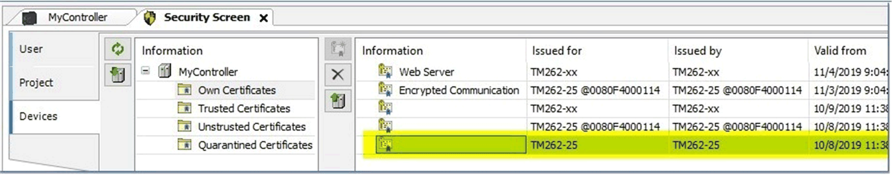

# Obtain the Controller Certificate

Obtain the Controller Certificate

You may need to transfer the digital certificate of the controller manually to the OPC UA server. The M262 controller has its own self-signed certificate that is created on the first power-on of the controller. This certificate can be obtained using the Security Screen in EcoStruxure Machine Expert Logic Builder, proceeding as described in the following table.

| Step | Action | Description/Comment |
| --- | --- | --- |
| 1 | Open the EcoStruxure Machine Expert Logic Builder and create a project with the corresponding M262 controller. | - |
| 2 | In the EcoStruxure Machine Expert Logic Builder, execute the Security Screen editor from the View menu. | - |
| 3 | Switch to the Devices tab of the Security Screen. | - |
| 4 | Click the button Refresh the list of available devices and their certificate stores. | Result: The display is updated according to the information received from the connected controller. |
| 5 | Select the Own Certificates tab. | - |
| 6 | Select the certificate from the list on the right-hand side of the Security Screen editor, and click the Upload the selected certificate from the device and save it to your PC button. | See figure below. |
| 7 | In the Save as dialog, navigate to a folder on your PC where you want to save the certificate file and click the Save button. | - |

Also refer to chapter [Security Screen Editor](../../../../../../api/crossBook?lang=en-US&virtualBookName=HowMgCer&topicID=D_SE_0096333_8) in the How To Manage Certificates User Guide.