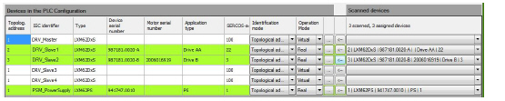

# Scanning for Devices

Scanning for Devices

| Step | Action |
| --- | --- |
| 1 | Start the Sercos scan under Tools Tree > Device Addressing > Start SERCOS scan. |
| 2 | If you receive the Scanning stops all other applications, resets all error messages and SERCOS is put in phase 0. Do you still want to scan SERCOS? message, click Yes. |
| 3 | Assign found devices to Devices in the PLC configuration. |
| 4 | Look for PSM\_PowerSupply under Devices in the PLC Configuration, click the arrow at the corresponding field under Scanned devices and select the power supply LXM62PS. Click the <--button to assign it.  G-SE-0056211.1.png |
| 5 | Look for DRV\_Slave1 under Devices in the PLC Configuration, click the arrow at corresponding field under Scanned devices and select the drive LXM62DxS Drive AA. Click the <--button to assign it. |
| 6 | Look for DRV\_Slave2 under Devices in the PLC Configuration, click the arrow at corresponding field under Scanned devices and select the drive LXM62DxS Drive B. Click the <--button to assign it. |
| 7 | For the assigned devices, the Operation Mode changes to Real and the line under Devices in the PLC Configuration turns green. |

