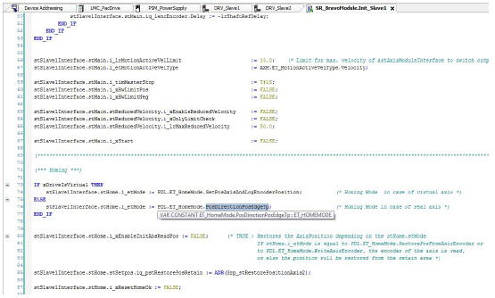

# Customizing Software Parameters

Customizing Software Parameters

| Step | Action |
| --- | --- |
| 1 | Click Applications Tree > Application > TemplateFullProgrammingFramework > SR\_BravoModule > Init\_Slave1 to open the code for customizing the software parameters. |
| 2 | Set Homing Mode to Touch Probe (Edge) |
| 3 | Scroll down to (\*\*\* Homing \*\*\*) and modify the line ending in (\* Homing Mode in case of real axis \*) to stSlave1Interface.stHome.i\_etMode := PDL.ET\_HomeMode.PosDirectionPosEdgeTp; (\* Homing Mode in case of real axis \*). |

