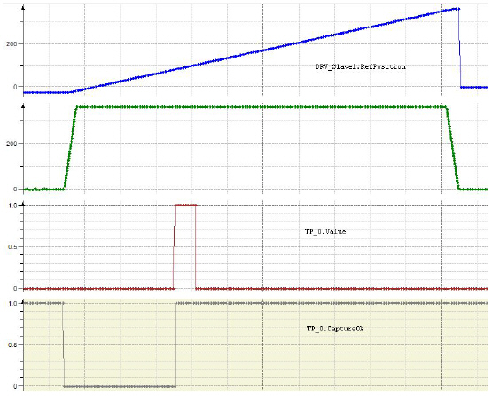

# Touch Probe

Touch Probe

Touch Probe as a Physical Device and as Represented in The Controller

A touch probe as a physical device is an electric circuit closed or opened when something touches or approaches the sensor, leading to a rising or falling edge to be detected.

Touch probe functionality in the controller is not only a rising or falling edge, but also covers keeping track of the actual position referenced by the rising or falling edge.

Homing

The controller needs information about the absolute position of the motor to synchronize the position of the representation of the motor in the controller with the physical motor. The process of gathering this information is called “homing”. There are several ways to accomplish this, for example torque or current can be monitored while traveling against a stopper and exceeding a maximum torque or maximum current indicates reaching the home position. Another way is using a touch probe, as in this example.

Customizing Software Parameters

| Step | Action |
| --- | --- |
| 1 | Click Applications Tree > Application > TemplateFullProgrammingFramework > SR\_BravoModule > Init\_Slave1 to open the code for customizing the software parameters. |
| 2 | Set Homing Mode to Touch Probe (Edge) |
| 3 | Scroll down to (\*\*\* Homing \*\*\*) and modify the line ending in (\* Homing Mode in case of real axis \*) to stSlave1Interface.stHome.i\_etMode := PDL.ET\_HomeMode.PosDirectionPosEdgeTp; (\* Homing Mode in case of real axis \*). |

Set Touch Probe Parameters

While you are still in SR\_BravoModule.Init\_Slave1, scroll down to (\* Possible modes for homing mode TouchProbe and modify the lines below the comment:

stSlave1Interface.stHome.stTouchProbe.i\_lrHomePosition  := 0.0;   (\* Position at the end of homing in units \*)  
stSlave1Interface.stHome.stTouchProbe.i\_lrVel    := 360.0;  (\* Homing ceiling velocity in units/s \*)  
stSlave1Interface.stHome.stTouchProbe.i\_lrAcc    := 10800.0;  (\* Homing acceleration in units/s^2 \*)  
stSlave1Interface.stHome.stTouchProbe.i\_lrDec    := 10800.0;  (\* Homing deceleration in units/s^2 \*)  
stSlave1Interface.stHome.stTouchProbe.i\_lrJerk    := 1E9;  (\* Homing jerk in units/s^3 \*)  
stSlave1Interface.stHome.stTouchProbe.i\_lrOffset   := 280.0;  (\* Offset from home signal in units \*)  
stSlave1Interface.stHome.stTouchProbe.i\_lrMaxTravel   := 370.0;  (\* Max. travel for referencing by TP \*)  
stSlave1Interface.stHome.stTouchProbe.i\_xRotativeSystem  := TRUE;  (\* Rotative system true or false for referencing by TP \*)  
stSlave1Interface.stHome.stTouchProbe.i\_ifTouchProbe  := TP\_0;  (\* Input for TP \*)

oi\_lrHomePosition remains unchanged.

oExecute the following actions:

| Step | Action |
| --- | --- |
| 1 | Change i\_lrVel to 360.0 to speed up the homing procedure for the test system. |
| 2 | Change i\_lrAcc to 10800.0 to speed up the homing procedure for the test system. |
| 3 | Change i\_lrDec to 10800.0 to speed up the homing procedure for the test system. |
| 4 | Change i\_lrJerk to 1E9 to speed up the homing procedure for the test system. |
| 5 | Change i\_lrOffset to 280.0 to determine how many units (here: degrees) the drive should travel to the home position after the signal from the touch probe is detected. |

oi\_lrMaxTravel remains unchanged.

oi\_xRotativeSystem remains unchanged.

Online: Transmitting Your Project to The Logic Motion Controller

| Step | Action |
| --- | --- |
| 1 | Click Online > Login. |
| 2 | In the hazard message that appears, click Cancel to cancel the login operation or press ALT + F to confirm the message and to log into the selected controller. |
| 3 | If you logged into the controller, confirm the code download to the controller. |
| 4 | Click Debug > Start to run the code on the controller. |

Visualization

| Step | Action |
| --- | --- |
| 1 | Click Tools Tree > Template Full Programming Framework > Visualization > VIS\_Main. |
| 2 | Click Enable Vis, then Machine Control. |
| 3 | If there are Messages other than Ok on the left-hand side of Diag Quit, click Diag Quit. |
| 4 | Click Prepare, then Start. The servo axis rotates and stops at 280 degrees (the value of stSlave1Interface.stHome.stTouchProbe.i\_lrOffset). |

Traces

| Step | Action |
| --- | --- |
| 1 | To add a variable to a trace, right-click on the variable, click Add variable to trace and chose an existing trace or New trace.  To watch homing with touch probe, add Value and CaptureOk of touch probe and RefPosition and RefVelocity of the servo drive. |
| 2 | After you have added the variables to trace, you need to download the trace onto the controller. Open the trace from Tools Tree, right-click on the trace and click Download Trace. |
| 3 | Once you have downloaded the trace onto the controller, you can click Start Trace. |
| 4 | Let homing run, then click Stop Trace. |

You can see the rising edge of the signal from touch probe (TP\_0.Value) setting TP\_0.CaptureOk to 1 and from this point in time DRV\_Slave1.RefPosition increases another 280 degrees until it stops.

EIO0000002712.00

© 2018 Schneider Electric. All rights reserved.