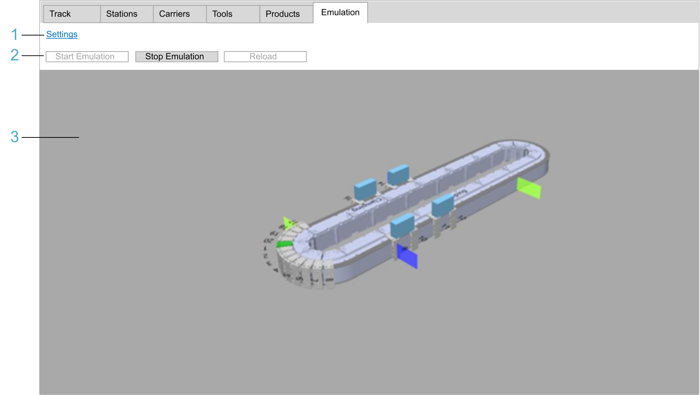

# Emulating Your Objects

## Overview

Open the tab that includes the emulation view to display a 3-D emulation of your configured object and to visualize your object running virtually.

As an example, the figure illustrates the emulation view of a multi carrier track in the Emulation tab of the Multicarrier Configuration editor in EcoStruxure Machine Expert:

| Legend item | Description | Refer to |
| --- | --- | --- |
| 1 | The Settings link is used for configuring the emulation via EcoStruxure Machine Expert Twin and the OPC UA communication between EcoStruxure Machine Expert Twin and the controller. | [Settings](#Emulating-AE39D42D__Settings-AE3A903E) |
| 2 | The Start Emulation and Stop Emulation buttons are used for starting and stopping the emulation.  The Reload button refreshes the assemblies after you have modified the configuration of the multi carrier. | [Start Emulation / Stop Emulation](#Emulating-AE39D42D__StartEmulationStopEmulation-AE3A92D0) |
| 3 | The View area displays a 3-D emulation of your configured object and for visualizing your object running virtually. | [View](#Emulating-AE39D42D__View-AE3A9952) |

## Settings

Click the Settings link to open the Emulation Settings view of the logic motion controller device editor.

The Emulation Settings view is described in the

[EcoStruxure Machine Expert Programming Guide](../../../../../api/crossBook?lang=en-US&virtualBookName=SoMProg&topicID=EmulationSet_62025FC3).

## Start Emulation / Stop Emulation

| Element | Description |
| --- | --- |
| Start Emulation | Click the Start Emulation button to connect to the OPC UA server on the controller (via EcoStruxure Machine Expert Twin running in the background) and start the emulation of the object.  If you click the Start Emulation button while the option Open User Interface is activated in the [Emulation Settings of the PacDrive LMC controller device editor](../../../../../api/crossBook?lang=en-US&virtualBookName=SoMProg&topicID=EmulationSet_62025FC3) , the emulation is displayed in EcoStruxure Machine Expert Twin. The emulation view in EcoStruxure Machine Expert returns to its initial state.  NOTE: For detailed steps and prerequisites, refer to EcoStruxure Machine Expert. |
| Stop Emulation | Use this button to stop the emulation and disconnect from the OPC UA server on the controller. |

## Procedure for Starting the Emulation

| Step | Action |
| --- | --- |
| 1 | Configure an OPC UA server on your controller and add code to your application for starting it.  NOTE: If the option Disable anonymous login is activated in the General Settings tab of the OPC UA Server Configuration of the PacDrive LMC controller, a user account needs to be configured in the device user management of the controller that is member of a group with access rights Modify and View to the OPC\_UA runtime object  For information about starting an OPC UA server on a PacDrive LMC controller, refer to the [*OPC UA Server Configuration*](../../../../../api/crossBook?lang=en-US&virtualBookName=PD.Parameter.LMCPro&topicID=D_SE_0070729). |
| 2 | In the Emulation Settings tab of the PacDrive LMC device editor, configure the IP address of the OPC UA server and the login mode.  NOTE: Activate the option Anonymous Login only in case the option Disable anonymous login was not activated in the General Settings tab of the OPC UA Server Configuration of the PacDrive LMC controller.  For further information, refer to the [EcoStruxure Machine Expert Programming Guide](../../../../../api/crossBook?lang=en-US&virtualBookName=SoMProg&topicID=EmulationSet_62025FC3). |
| 3 | Verify that the Symbol Configuration object is part of the application and that the emulation data are selected.  For further information, refer to the [EcoStruxure Machine Expert Programming Guide](../../../../../api/crossBook?lang=en-US&virtualBookName=SoMProg&topicID=D_SE_0083585). |
| 4 | Download the application (including the OPC UA server in the Symbol Configuration) to the controller and start the application. |
| 5 | In the emulation view, click the Start Emulation button. |
| 6 | If the option Disable anonymous login is activated in the General Settings tab of the OPC UA Server Configuration of the PacDrive LMC controller, the OPC UA Credentials dialog box opens. Enter the credentials of a user account that has been configured in the device user management of the controller (refer to step 1) and click OK to log in. |
| 7 | Accept the controller certificate. |
| 8 | If the option Only allow secure sessions is activated in the General Settings tab of the OPC UA Server Configuration of the PacDrive LMC controller, you need to declare the EcoStruxure Machine Expert Twin certificate as trusted.  NOTE: The certificate name is Machine Expert Twin@xxxx, where xxxx is the name of the client PC.  For further information, refer to [*Define Trusted Client Certificates*](../../../../../api/crossBook?lang=en-US&virtualBookName=PD.Parameter.LMCPro&topicID=D_SE_0070730). |
| 9 | Once the EcoStruxure Machine Expert Twin certificate is in the trusted certificates list, click the Start Emulation button. |

## View

The View area displays a 3-D emulation of your configured object and you can visualize your object running virtually.

Zooming, rotating, and moving the object in the View area:

* Zooming: Use the mouse scroll wheel.
* Rotating: Left-click and hold, then move the mouse.
* Moving: Right-click and hold, then move the mouse.

NOTE: The viewer provides restricted functions (such as only one object can be emulated within the viewer at a time). For extended functions, use the standalone version, EcoStruxure Machine Expert Twin, that was installed with your EcoStruxure Machine Expert.

For further information, refer to the [EcoStruxure Machine Expert Twin online help](https://product-help.schneider-electric.com/Machine%20Expert%20Twin/LandingPages/en/index.html).

EIO0000004858.01