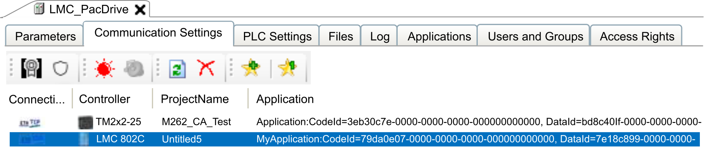
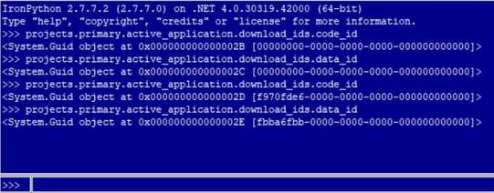
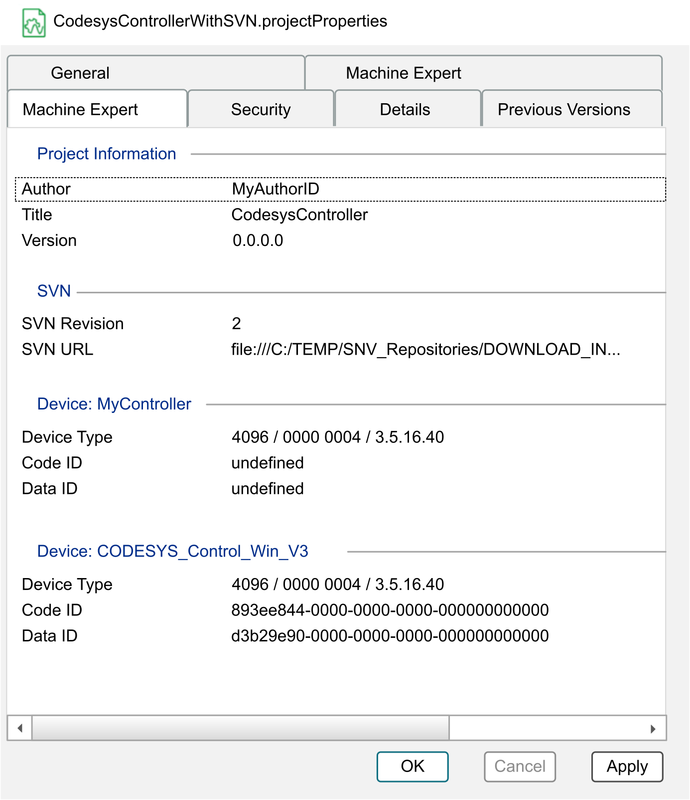

# Code ID / Data ID in Windows File Properties

## Application Identification

The Code ID and Data ID information allows you to identify the application and the version of the application that is running on the controller without opening the project in EcoStruxure Machine Expert (also refer to [Creating and Accessing Code ID / Data ID](#CodeIDApplicationID-920EF017__CreatingAndAccessingCodeIDApplicati-9212BBA0)). To verify the application and the version, you can compare the information provided in the file properties with the Code ID and Data ID information that is provided at the following locations:

* In the Communication Settings  tab of the EcoStruxure Machine Expert Logic Builder.

  
* In the EcoStruxure Machine Expert Python Application Programming Interface (API).

  
* In the Diagnostics tool

  when opening the .pdi file.

## Creating and Accessing Code ID / Data ID

Whenever an Online > Download or Online > Multiple Download command is executed and the project is saved, Code ID and Data ID information is created or updated and stored in the project file. This information is accessible in the Machine Expert tab of the Windows file properties. Open the dialog box by right-clicking the .project or .projectarchive file and executing the command Properties.

EIO0000004729.00