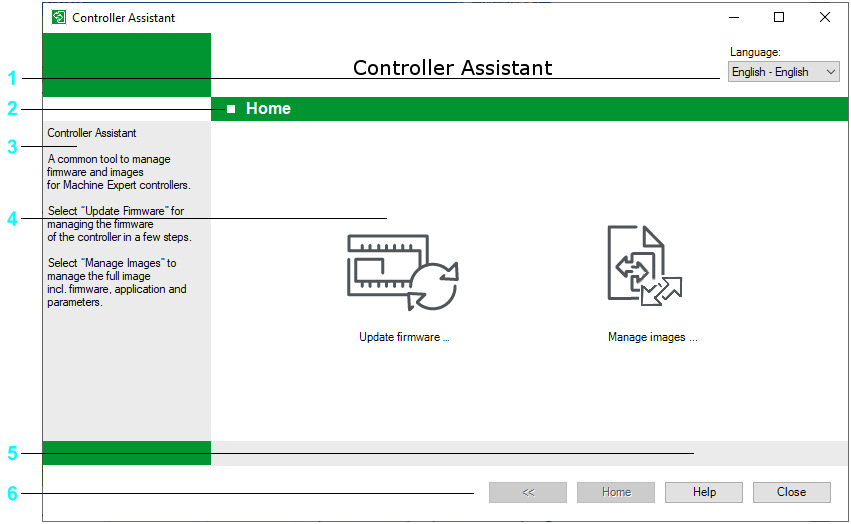

# Home Dialog

## Overview

The Home dialog opens after the startup of the Controller Assistant. It provides quick access to the main functions.

The main elements are in the middle of the dialog (legend item 4 in the following graphic). To perform a function, click a symbol that works as a button.

You can return to the Home dialog from each sub dialog by clicking the Home button (legend item 6 in the following graphic).

In the information field (3), you receive information on the selected dialog or selected button. In addition, the information field provides you with information on how to proceed further within the individual functions.

The status bar comprises controller type / IP address / firmware version / image size / DHCP / BOOTP, if available. On hovering the status bar, detailed information is displayed in the left-hand information field (3).

The Home dialog

**1** Changes the language of the Controller Assistant

**2** Title of the dialog box or data view

**3** Info field providing you with information on the operation of the selected window or instructions on how to use the operating button selected

**4** Main elements providing access to the core operating elements in a single view

**5** Status bar providing brief information on the selected controller

**6** Buttons available in most of the dialog boxes

## Main Elements

You can access the core functions of the Controller Assistant directly from the Home dialog via buttons in the form of symbols.

Click the Update firmware... button to update the firmware of a connected controller.

A firmware update started via Update firmware ... on the Home dialog not only updates the firmware of a connected controller, but also deletes the application and the other data stored on the controller.

A firmware update started via Manage images ... on the Home dialog updates the firmware in the current image. Other data is not modified.

| NOTICE | |
| --- | --- |
|  | LOSS OF DATA  Back up the data stored on the controller to a location in your file system before attempting to perform a firmware update.  Failure to follow these instructions can result in equipment damage. |

Procedure for backing up the data stored on the controller to a location in your file system:

|  |  |
| --- | --- |
| Step | Action |
| 1 | Click Manage images ... on the Home dialog. |
| 2 | Click Read from ... (controller icon). |
| 3 | Select the controller from the list and click Connect. |
| 4 | Enter the information for which Controller Assistant prompts (depend on controller). |
| 5 | Click Save ... and specify a storage location in your file system. |

Click the Manage images... button to manage images.

* If maintenance work has to be performed (for example, firmware and project updates of a controller), first back up the data of the entire controller software.
* If following an update, the preceding version must be used again, the backed-up software can be uploaded again.
* If the content of the controller is to be used on another controller, you can generate an identical copy of a controller.
* Possibly you may simply want to back up the status of the software of a controller.
* Update the firmware without deleting the application.

## Buttons

The Home, Help, Close and << buttons are available in the various windows.

The following is a short overview of the individual elements:

* Home

  Click this button to return to the Home dialog.

  NOTE: Click the Home button to return to the Home dialog at any time. This button is simultaneously used to cancel a function.
* Help

  Displays the online help.
* Close

  Ends the Controller Assistant.
* <<

  Opens the preceding step.

EIO0000001671.07