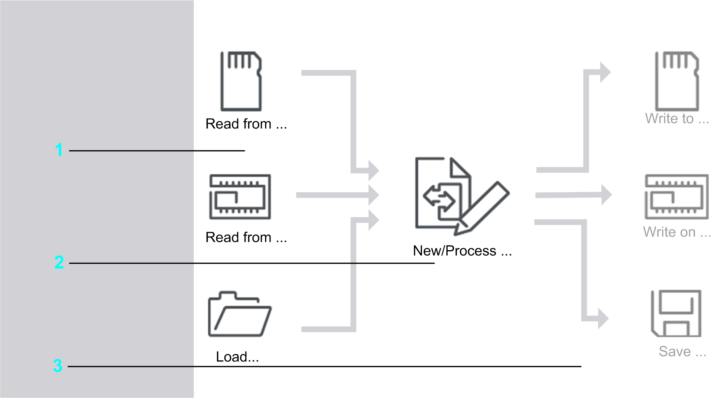

# Managing Images

## Overview

Click the Manage images... button in the Home dialog, for a quick access to the functions allowing you to manage images.

NOTE: Depending on the user mode or on the state of the active image, individual buttons can be inactive.

The status bar below the main elements comprises controller type / IP address / firmware version / image size / DHCP / BOOTP, if available.

## Main Elements

The Manage images dialog allows you to manage [controller images](D-SE-0031751.html#D-SE-0031751).

Click the buttons to call up core functions directly.

The main elements are divided into 3 areas:

| Area | Description |
| --- | --- |
| 1 | On the left, there are the functions for loading an image to Controller Assistant. An image can be optionally loaded from a flash disk, a controller or directly from the file system of your computer to the Controller Assistant. |
| 2 | Clicking the symbol in the center leads to dialogs for creating a new image or editing a loaded image. |
| 3 | The functions on the right-hand side are used to rewrite an image again to another destination location. It can also be written to a flash disk, a controller or directly into the file system of your computer. You can select source and destination independently of one another. |

NOTE: When selecting a controller as destination, the image has to be suitable for the selected controller. Additionally, you can change the firmware of the active image without deleting the application by clicking the New / Process... > Update firmware ... button.

EIO0000001671.07