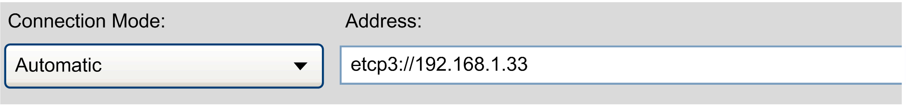

# Overview of Call Parameters

## Overview

You can start the Controller Assistant by writing a series of call parameters into a batch file and executing it via the Windows Run... command in the Start menu. Some of these call parameters execute program functionalities.

NOTE: If the commands are called up via a batch file, then the processing takes place synchronously. However, by a call via a console, the processing takes place asynchronously. To be able to perform synchronous processing via a console, set the prefix `start /b /wait` before the command.

Example:

```
start / b/ wait ControllerAssistant.exe 
-loadcontrol ip etcp3://10.128.225.156 "c:\temp\Result.log"
```

## Optional and Default Values

The values of the following parameters are optional. Default values are used if no specific value is indicated.

```
ImagePath
```

If the parameter `<ImagePath>` is not available, then the directory of the Controller Assistant is used. The path is shown in the ImageManager [dialog](D-SE-0031862.html#D-SE-0031862).

```
Logfile
```

If the parameter `<Logfile>` is not available, then a logfile named errorlog.log is created in parallel to the default value of the parameter `<ImagePath>`.

## Target Address URI

Some commands have a parameter `<TargetAddressURI>`. This parameter requires a URI (uniform resource identifier) for the target address of the controller.

To get the correct URI, enter the target address with the desired Connection Mode in the Controller selection [dialog](D-SE-0031850.html#D-SE-0031850). Then select the option Automatic from the Connection Mode list. You can copy the URI directly from the Address field.



NOTE: For PacDrive M controllers, the URI prefix `etcp2://` is used to establish a connection via IP address.

## Image Directory

Many of the commands work on the active image that is saved in the directory specified with the `ImagePath` [parameter](#D-SE-0031752__D-SE-0031752.5). This path can be changed for this command call by adding the parameter `-imagedirectory` with the desired image directory path.

| NOTICE | |
| --- | --- |
|  | LOSS OF DATA  Verify the directory path provided by the command line argument `-imagedirectory` before executing the command.  Failure to follow these instructions can result in equipment damage. |

NOTE: All existing files in the target folder will be deleted.

**Example:**

```
ControllerAssistant -imagedirectory c:\Temp\MyImage
-loadfile C:\Temp\Default.bpd C:\Temp\Logfile.log
```

EIO0000001671.07