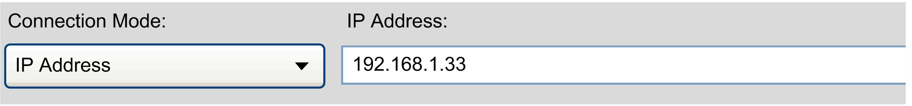

# List of Call Parameters

## Setting the Default Target Address in the Controller Selection Dialog

Use the following command to set the target IP Address value of the Controller selection [dialog](D-SE-0031850.html#D-SE-0031850) to a specified value. Also refer to the description of the parameter [<TargetAddressURI>](D-SE-0031752.html#D-SE-0031752__D-SE-0031752.6).



For secured access, you can use additional [call parameter switches](D-SE-0104618.html#D-SE-0104618).

**Usage:**

```
ControllerAssistant -connect ip <TargetAddressURI>
```

**Examples:**

```
ControllerAssistant -connect ip 192.168.1.33
```

```
ControllerAssistant -connect ip etcp3://192.168.1.33
```

```
ControllerAssistant -connect ip etcp2://192.168.1.33
```

```
ControllerAssistant -connect ip "enodename3://MyController (192.168.1.33)"
```

## Setting the Default Path of the File Dialogs

Use the following command to set the default path of the Open and Save [dialog boxes](D-SE-0031852.html#D-SE-0031852) to a specified value.

**Usage:**

```
ControllerAssistant -file <Path>
```

**Example:**

```
ControllerAssistant -file C:\Temp\Default.bpd
```

## Loading Image from Controller

Use the following command to start a backup of the specified controller and to save the backup as the image. The process sequence of this backup is entered into the specified log file. The program runs without graphical user interface. Also refer to the description of the parameter [<TargetAddressURI>](D-SE-0031752.html#D-SE-0031752__D-SE-0031752.6).

For secured access, you can use additional [call parameter switches](D-SE-0104618.html#D-SE-0104618).

For reading the device user rights management you can use the optional command line argument `-ReadOnlineUserRightsManagement <ignore|read>`. If you want to read the device user rights management, then you need additionally the command line argument `-UserRightsManagementPassword <MyUserRightsManagementPassword>`. For the graphical version and a detailed explanation see [Device User Rights Management](D-SE-0104135.html#D-SE-0104135).

**Usage:**

```
ControllerAssistant [-username <UserName>] [-password <Password>] [-renewalpassword <RenewalPassword>] [-imagedirectory <ImageDirectoryPath>] -loadcontrol <TargetAddressURI> [-ReadOnlineUserRightsManagement <ignore|read> -UserRightsManagementPassword <MyUserRightsManagementPassword>] [<logfile>]
```

**Examples:**

```
ControllerAssistant 
-loadcontrol ip etcp3://190.201.100.100 C:\Temp\Logfile.log
```

```
ControllerAssistant 
-imagedirectory c:\Temp\MyImage 
-loadcontrol ip etcp3://190.201.100.100 C:\Temp\Logfile.log
```

```
ControllerAssistant -username MyUserName -password MyPassword -renewalpassword MyRenewalPassword -imagedirectory c:\Temp\MyImage -loadcontrol ip etcp4://190.201.100.100 -ReadOnlineUserRightsManagement read -UserRightsManagementPassword MyUserRightsManagementPassword C:\Temp\Logfile.log
```

NOTE: If you start the Controller Assistant with the GUI (Graphical User Interface), you can also set the three arguments - username, -password, and -renewalpassword. In this case, you are not prompted to enter credentials. The credentials are retrieved from the values of the arguments.

NOTE: In order to save the active image into a single image file (file extension \*.bdp), additionally call `-savefile`.

NOTE: All existing files in the target folder will be deleted.

| NOTICE | |
| --- | --- |
|  | LOSS OF DATA  Verify the directory path provided by the command line argument `-imagedirectory` before executing the command.  Failure to follow these instructions can result in equipment damage. |

## Saving Image to a Controller

Use the following command to save the image in the specified controller. The saving sequence is entered into the specified log file. The program runs without graphical user interface. Also refer to the description of the parameter [<TargetAddressURI>](D-SE-0031752.html#D-SE-0031752__D-SE-0031752.6).

For secured access, you can use additional [call parameter switches](D-SE-0104618.html#D-SE-0104618).

For writing the device user rights management you can use the optional command line argument `-WriteOnlineUserRightsManagement <keep|overwrite|restore>`. If you want to overwrite the device user rights management, then you need additionally the command line argument `-UserRightsManagementPassword <MyUserRightsManagementPassword>`. For the graphical version and a detailed explanation see [Device User Rights Management](D-SE-0104135.html#D-SE-0104135).

**Usage:**

```
ControllerAssistant [-username <UserName>] [-password <Password>] [-renewalpassword <RenewalPassword>] [-imagedirectory  <ImageDirectoryPath>] -savecontrol <TargetAddressURI> [-WriteOnlineUserRightsManagement <keep|overwrite|restore> -UserRightsManagementPassword <MyUserRightsManagementPassword>] [<logfile>]
```

**Examples:**

```
ControllerAssistant 
-savecontrol ip etcp3://190.201.100.100 C:\Temp\Logfile.log
```

```
ControllerAssistant -imagedirectory c:\Temp\MyImage 
-savecontrol ip etcp3://190.201.100.100 C:\Temp\Logfile.log
```

```
ControllerAssistant -username MyUserName -password MyPassword -renewalpassword MyRenewalPassword -imagedirectory c:\Temp\MyImage -savecontrol ip etcp4://190.201.100.100 -WriteOnlineUserRightsManagement overwrite -UserRightsManagementPassword MyUserRightsManagementPassword C:\Temp\Logfile.log
```

NOTE: If you start the Controller Assistant with the GUI (Graphical User Interface), you can also set the three arguments - username, -password, and -renewalpassword. In this case, you are not prompted to enter credentials. The credentials are retrieved from the values of the arguments.

NOTE: For the `-savecontrol` command line argument, the file system of the controller is overwritten without any prompt at the point of execution of the command, and the controller thereafter resets.

| WARNING | |
| --- | --- |
|  | LOSS OF DATA AND POSSIBLE UNINTENDED EQUIPMENT OPERATION  Verify that the active image, with its program, configuration and memory, corresponds to the function of the controller within your machine or process.  Failure to follow these instructions can result in death, serious injury, or equipment damage. |

In order to load the active image from a single image file (file extension \*.bdp), call `-loadfile` before.

## Loading Image from Image File

To load the specified \*.bpd file as the image, use the following command. The loading sequence is entered into the log file specified. The program runs without graphical user interface.

**Usage:**

```
ControllerAssistant [-imagedirectory <ImageDirectoryPath>]
-loadfile <ImageFilePath> [<logfile>]
```

**Examples:**

```
ControllerAssistant -loadfile C:\Temp\Default.bpd C:\Temp\Logfile.log
```

```
ControllerAssistant -imagedirectory c:\Temp\MyImage
-loadfile C:\Temp\Default.bpd C:\Temp\Logfile.log
```

## Saving Image to Image File

To save the image in the specified \*.bpd file, use the following command. The saving sequence is entered into the log file specified. The program runs without graphical user interface.

**Usage:**

```
ControllerAssistant [-imagedirectory <ImageDirectoryPath>]
-savefile <ImageFilePath> [<logfile>]
```

**Examples:**

```
ControllerAssistant -savefile C:\Temp\Default.bpd C:\Temp\Logfile.log
```

```
ControllerAssistant -imagedirectory c:\Temp\MyImage
-savefile C:\Temp\Default.bpd C:\Temp\Logfile.log
```

## Getting Installed Firmware Versions

Use the following command to save an XML file with a list of the firmware versions of the given controller type that can be found on this PC at the result path. The result provides the same information as available inside the graphical user interface.

If the switches `-ProductName` and `-ProductVersion` are set, the XML file contains only results for the given product name and product version.

**Usage:**

```
ControllerAssistant
-getinstalledfirmwareversionsXml <ControllerType> <ResultPath>  [-ProductName <ProductName>]
[-ProductVersion <ProductVersion>] [<logfile>]
```

**Example:**

```
ControllerAssistant
-getinstalledfirmwareversionsXml LMC058 c:\Temp\MyVersions.xml
```

```
ControllerAssistant
-getinstalledfirmwareversionsXml M241 c:\Temp\MyVersions.xml -ProductName SoMachineSoftware -ProductVersion V4.3
```

```
ControllerAssistant
-getinstalledfirmwareversionsXml M262 c:\Temp\MyVersions.xml -ProductName EcoStruxureMachineExpert
```

## Retrieving the Firmware Versions of all Sercos Devices of a Controller

Use the following command to save an XML file with a list of all the firmware versions of all Sercos devices of the given controller type that can be found on this PC at the result path. The result provides the same information as available inside the graphical user interface.

**Usage:**

```
ControllerAssistant
- getinstalledsercosfirmwareversionsXml <ControllerType> <ResultPath>
[<logfile>]
```

**Example:**

```
ControllerAssistant
- getinstalledsercosfirmwareversionsXml LMC600C c:\Temp\MyVersions.xml
```

## Creating a New Image

The call via command line creates the image from the given controller type or family and the given version. The same functionality is also available in the graphical user interface.

**Usage:**

```
ControllerAssistant -createimage <ControllerType> <FirmwareVersion> [<logfile path>] [imagepath=<image path>]
```

**Example:**

```
ControllerAssistant -createimage LMC400C 1.50.1.3 c:\Temp\MyLogfile.log
```

NOTE: The [XML command for creating the controller firmware](D-SE-0043720.html#D-SE-0043720__D-SE-0043720.5) offers additional features.

## Updating Firmware Version of the Active Image

The call via command line updates the firmware of the active image by the given version. The same functionality is also available in the graphical user interface. The controller type and the firmware version are given by the existing image directory. If a compatible version is detected, the update is performed without removing the existing application.

**Usage:**

```
ControllerAssistant [-imagedirectory <ImageDirectoryPath>]
-updateimage <FirmwareVersion> [<LogFile>]
```

**Examples:**

```
ControllerAssistant -updateimage 1.50.1.3 c:\Temp\MyLogfile.log
```

```
ControllerAssistant -imagedirectory c:\Temp\MyImage
-updateimage 1.50.1.3 c:\Temp\MyLogfile.log
```

## Updating Communication Settings

The call via command line updates the communication settings of a controller inside an existing image by the given communication settings. The same functionality is also available in the graphical user interface.

**Usage:**

```
ControllerAssistant [-imagedirectory <ImageDirectoryPath>]
-updatecommunicationsettings <IPaddress>
<SubnetMask> <Gateway> <IPMode(fixed | bootp | dhcp)> <DeviceName>
[<logfile path>]
```

The `DeviceName` is used with `IPMode dhcp`. On some controllers, `IPMode` and `DeviceName` are ignored.

**Examples:**

```
ControllerAssistant 
-updatecommunicationsettings 10.128.111.222 255.255.255.0 10.128.111.1 fixed "" c:\temp\version.log
```

```
ControllerAssistant -imagedirectory "c:\temp\MyImage"
-updatecommunicationsettings 10.128.111.222 255.255.255.0 10.128.111.1 dhcp "MyDeviceName" c:\temp\version.log
```

## Getting the Program Version

Use the following command to retrieve the version number of the Controller Assistant application. The optional log file `<LogFile>` is used to log the result and detected errors. Also refer to the description of [optional and default values](D-SE-0031752.html#D-SE-0031752__D-SE-0031752.5).

**Usage:**

```
ControllerAssistant -getProgramVersion [<logfile>]
```

**Example:**

```
ControllerAssistant -getProgramVersion c:\temp\version.log
```

## Creating a User Folder with Specific Data on the Flash Disk

Use the following command to add specific files to a controller image.

**Usage:**

```
ControllerAssistant [-imagedirectory <ImageDirectoryPath>]
-addCustomFiles <sourcePath> [<relativeDestinationPath>]
[logfile=<logfile>]
```

The `SourcePath` is a folder containing the files that are copied into the controller image. This path can also contain subdirectory structures. The `RelativeDestinationPath` is optional and specifies a subfolder inside the controller image where the files are stored. The subfolder or a structure of subfolders is relative to the root folder of the `imagepath`.

**Examples:**

```
ControllerAssistant -addCustomFiles "c:\temp\MyRecipes"
```

```
ControllerAssistant -imagedirectory "c:\Temp\MyImage"
-addCustomFiles "c:\temp\MyRecipes" "MyFiles\MyRecipes" logfile=c:\temp\MyLogfile.log
```

## Copying Application Files and Adding an Application to the Configuration File of the Controller

Use the following command to add an application to an existing controller image. For example, for the LMC•0•C controller family, the \*.app and the corresponding \*.crc files are copied into the image folder and the `CmpApp` section of the \*sysc3.cfg file is modified.

NOTE: Some controller types do not support this command.

**Usage:**

```
ControllerAssistant [-imagedirectory <ImageDirectoryPath>]
-addapplication <ApplicationPath> <ApplicationName>
[logfile=<logfile>]
```

**Example:**

```
ControllerAssistant -imagedirectory c:\temp\MyImage
-addapplication c:\temp\MyApplicationFolderPath
MyApplicationName logfile=c:\temp\version.log
```

The `ApplicationPath` is the folder containing the \*.app and the corresponding \*.crc files. The `ApplicationName` is the name of the \*.app file (the file name without extension).

## Showing the Supported Commands

Use the following command to list the possible commands with its arguments on the console.

**Usage:**

```
ControllerAssistant -help
```

**Example:**

```
ControllerAssistant -help
```

## Establishing a Static Remote Connection

Use the `CreateRemoteConnection` command to establish a static remote connection to a controller specified by the IP address and the port.

**Syntax:**

```
-CreateRemoteConnection <ipAddressAndOptionalPort> [<RetryIfConnectionBreaks>]
```

| Parameter | Description |
| --- | --- |
| ``` <ipAddressAndOptionalPort> ``` | IP address and optional port, separated by a `:` (colon) character. |
| ``` <RetryIfConnectionBreaks> ``` | Optional parameter that defines the behavior in case of connection interruption:   * 0 (default value)  When the connection is interrupted, no automatic reconnection attempts are performed. * 1  When the connection is interrupted, automatic reconnection attempts are performed. The number of reconnection attempts is not limited. |

**Examples:**

```
ControllerAssistant -CreateRemoteConnection 192.168.2.50
```

```
ControllerAssistant -createremoteconnection 192.168.2.50:1105
```

```
ControllerAssistant -createRemoteConnection 192.168.2.50:1105 1
```

**Status of the connection:**

After you have executed the `CreateRemoteConnection` command, a Remote connection dialog box is displayed:

* It provides information on the status of the remote connection.
* It allows you to terminate the connection by clicking OK.
* If the connection cannot be established or is terminated, it provides further information on the possible reasons.
* It indicates whether you have activated the `<RetryIfConnectionBreaks>` parameter by notifying you that automatic reconnection attempts are performed.

**Application example:**

You can use the `CreateRemoteConnection` command, for example, in OPC server applications. It is useful if the OPC server is installed on a PC and intends to establish a connection to a controller that resides in another subnet (remote connection). In this case, establish the remote connection bridge with this command before starting the server. The remote controller can then be scanned by the local gateway. Terminate the connection after you have stopped the server.

## Stopping the Applications of a Specified Controller

Use the StopAllApplications command to stop the applications of the specified controller.

For secured access, you can use additional [call parameter switches](D-SE-0104618.html#D-SE-0104618).

**Usage:**

```
ControllerAssistant [-username <UserName>] [-password <Password>] [-renewalpassword <RenewalPassword>] -stopallapplications <TargetAddressURI> [<logfile>]
```

**Examples:**

```
ControllerAssistant -StopAllApplications etcp3://192.168.2.50
```

```
ControllerAssistant -StopAllApplications "enodename3://MyController (192.168.2.50)" "C:\Temp\Logfile.log"
```

```
ControllerAssistant -username MyUserName -password MyPassword -renewalpassword MyRenewalPassword -StopAllApplications "enodename3://MyController (192.168.2.50)" "C:\Temp\Logfile.log"
```

NOTE: If you start the Controller Assistant with the GUI (Graphical User Interface), you can also set the three arguments - username, -password, and -renewalpassword. In this case, you are not prompted to enter credentials. The credentials are retrieved from the values of the arguments.

## Behavior for CNC Files

The CNC files are stored on the internal memory of the controller in the folder `<root>/MECNC`.

The `cncsettings` call parameter switch can be used to set the behavior for the CNC files through the firmware creation or update process.

* `dontcreate` (default setting): The files in the folder `<root>/MECNC` folder are deleted through the firmware creation or update process.
* `path <PathToZippedFile>`: The files from the ZIP file (including subfolders) are copied to the folder `<root>/MECNC`.
* `preserve`: The files in the folder `<root>/MECNC` are preserved through the firmware creation or update process.

NOTE: The CNC licenses are stored in the folder `<root>/MECNC/License` and are not modified through the firmware creation or update process.

**Usage:**

```
ControllerAssistant -cncsettings [dontcreate|path <PathToZippedFile>|preserve]
```

**Examples:**

```
ControllerAssistant -cncsettings path C:\Temp\CNCfilesUpdate.zip
```

## Device Identification

Refer to [Network Device Identification Call Parameters](D-SE-0032047.html#D-SE-0032047) for additional command line calls specific for Network Device Identification.

## XML Commands

Refer to [XML Commands](D-SE-0043720.html#D-SE-0043720) for additional commands that are defined in XML formatted files.

EIO0000001671.07