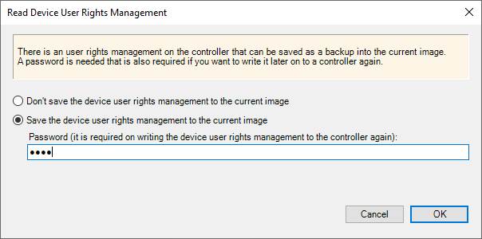
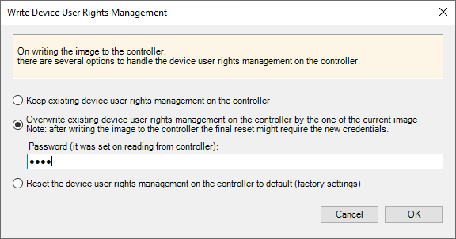

# Device User Rights Management

## General

Controller Assistant supports device user rights management for all EcoStruxure Machine Expert/EcoStruxure Automation Expert - Motion supported controllers.

## Reading Device User Rights Management

By attempting to read an image from the controller in online mode or from the SD card or flash disk, Controller Assistant displays a message that allows you to decide how to handle user rights in the controller:

The following options are available:

* Don’t save the device user rights management to the current image

  The device user rights management from the controller is not stored to the image.
* Save the device user rights management to the current image

  The device user rights management from the controller is stored to the image. You need to define a password for storing the device user rights management to the image. This password is needed if you attempt to write this image to a controller.

NOTE: Storing the device user rights management from the controller to the image is only possible in online mode.

## Writing Device User Rights Management

By attempting to write an image to the controller in online mode or to the SD card or flash disk, Controller Assistant displays a message that allows you to decide how to handle user rights in the controller:

The following options are available:

* Keep existing device user rights management on the controller

  The device user rights management in the controller is kept. This applies even if the device user rights management is disabled.
* Overwrite existing device user rights management on the controller by the one on the current image

  The device user rights management in the controller is overwritten by the device user rights management that is defined in the image you attempt to write.

  You need to use the password you defined during reading of the device user rights management.

  If the present image does not include a device user rights management, this option is disabled.

  NOTE: Writing the device user rights management to the controller from the image is only possible in online mode.
* Reset the device user rights management on the controller to default (factory settings)

  The device user rights management in the controller is set to the default settings.

By default, the user rights management existing in the controller are preserved when writing to the controller in online mode.

## Reset Without Credentials

If you have lost the credentials, you can reset the user rights management of the controller by using the service tool Controller Assistant to write the image to the SD card or flash disk.

From the message prompting you to decide how to handle user rights in the controller, select the option Reset the user rights management on the controller to default (factory settings). If this option is not available, you can create a new firmware from scratch that comes with the default settings. Then you can restart the controller directly from this SD card or flash disk.

The Modicon M241 Logic Controller, Modicon M251 Logic Controller, and the Modicon M262 Logic/Motion Controller also allow you to modify a script.cmd file on the SD card to reset the user rights management. Consult the *Programming Guide* specific to your controller for further information.

EIO0000001671.07