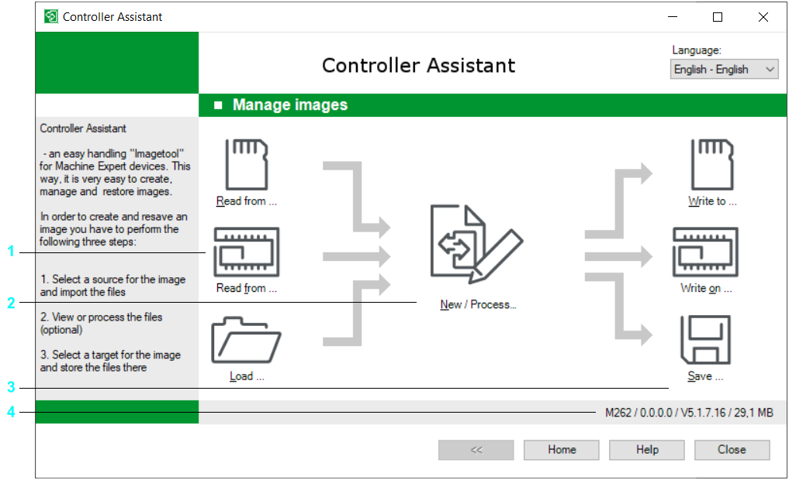

# Introduction

## Overview

If you click the Manage images... button in the Home dialog, the Manage images dialog opens.

The Manage images dialog

The Manage images dialog is subdivided into 4 areas.

| Area | Description |
| --- | --- |
| 1 | On the left, there are the functions for reading in an image in Controller Assistant. |
| 2 | The central area refers to the image managed by the Controller Assistant. You can edit or create the image, or you can replace the firmware in the image. |
| 3 | On the right-hand side, there are functions for writing the active image into a specific destination. |
| 4 | The status bar shows information on the active image:   * Controller  The controller type which the image refers to. * IP address  The IP address of the controller saved in the image. * Version  The firmware version of the image. * Size  This shows the size of the image. |
| Tooltip Source | This shows the origin of the active image. Possible variants are:   * Removable storage device (from CF card, SD card or USB mass storage device) * Controller (from controller) * Image file (from file system) |

EIO0000001671.07